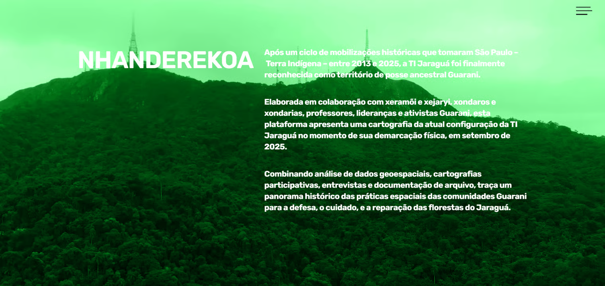

# Documental XYZ

[Documental.xyz](https://documental.xyz) é uma ferramenta para narrativas baseadas em mapas, que faz uso de recursos de _scrollytelling_ (interações a partir da rolagem de página) para navegação em dados geográficos.&#x20;

A plataforma opera a partir de um aplicativo (compatível por enquanto com Linux e Windows) que integra o sistema de publicação Sveltia, um _Content Management System_ (CMS), ao serviço de mapas online [Mapbox](https://www.mapbox.com/). Os arquivos da Documental são clonados em um repositório de sua escolha no [GitHub](https://github.com/), e as páginas podem ser publicadas através do [GitHub Pages](https://docs.github.com/pt/pages/getting-started-with-github-pages/what-is-github-pages) ou de um servidor próprio. As páginas são compatíveis com diferentes dispositivos, incluindo desktop, tablet e mobile.

<figure><figcaption>
Página inicial da geohistória <a href="https://documental.xyz/nhanderekoa/">Nhanderekoa</a>
</figcaption></figure>

<figure><figcaption>
Trecho de narrativa através de mapas da geohistória <a href="https://documental.xyz/expulsions/">Expulsions</a>.
</figcaption></figure>

Confira abaixo um resumo do conteúdo de nossa documentação:

* [Primeiro acesso:](_primeiro-acesso.md) Configuração de conta e repositório no GitHub, como acessar o aplicativo, informações gerais e lógica de funcionamento da plataforma.
* [Organizando os geodados no Mapbox:](organizando-geodados-no-mapbox.md) Um breve tutorial sobre a organização dos dados geográficos no Mapbox e sua integração com a Documental 2.0.
* [Criando uma história:](criando-uma-historia/) Breve tutorial sobre a criação de geohistórias através da Documental 2.0 e sobre como chamar os geodados do Mapbox. Acompanha uma biblioteca de blocos descrevendo todas as funcionalidades da plataforma.
* [Publicando uma história:](publicando-uma-historia.md) Como publicar uma página da Documental através do GitHub Pages ou  servidor próprio (usuários avançados).
* [Técnicas de scrollytelling:](tecnicas-de-scrollytelling.md) Revisão de alternativas, tecnologias e estratégias para construção de histórias com scrollytelling baseadas em mapas, para além do Documental
* [Como colaborar?:](como-colaborar.md) Lista de funcionalidades futuras desejáveis e informações para pessoas desenvolvedoras interessadas em colaborar com o projeto.
* [Referências e recursos:](referencias-e-recursos.md) Compilado parcial e inicial de materiais externos úteis.
* [Equipe:](equipe.md) Pessoas e organizações envolvidas com o Documental.

#### Para quem esta documentação se destina?

Qualquer pessoa interessada pode ler a documentação sobre a ferramenta, porém, para implementar uma instância da plataforma "do zero" e publicar uma história usando os recursos do Documental, é recomendável que uma ou mais pessoas tenha conhecimento técnico sobre noções básicas sobre a manipulação de dados geográficos.

#### Preciso pagar?

A Documental é uma solução baseada em softwares de código aberto. Para executar a plataforma localmente é necessário instalar o aplicativo da Documental que executa o Sveltia (CMS) no seu computador, criar uma conta gratuita no GitHub e uma conta gratuita no Mapbox. Para publicar uma página, você configura uma hospedagem gratuita através do Github Pages, apesar de que você também pode contratar um servidor.&#x20;

O Mapbox adota um modelo _freemium_, onde é possível usufruir de certas soluções com uma conta gratuita, mas é preciso assinar um serviço pago para obter recursos mais avançados. Os recursos gratuitos ou de código aberto são suficientes para configurar uma instância da plataforma da Documental, a versão gratuita do Mapbox serve para a maioria dos casos.

<table><thead><tr><th width="263.60003662109375">Características</th><th>Mapbox</th></tr></thead><tbody><tr><td>Plano gratuito</td><td>Até 50 mil visualizações do mapa por mês.</td></tr><tr><td>Valor do plano pago</td><td>Preços a partir de 50 dólares por mês ou sob demanda, a depender dos serviços utilizados ou quantidade de acessos.</td></tr><tr><td>Funcionalidades pagas</td><td>Mais camadas, mais visualizações de mapas, suporte,etc.</td></tr></tbody></table>

Para mais informações sobre os recursos pagos, confira a página do [Mapbox](https://www.mapbox.com/pricing).

#### Como creditar o projeto?

Solicitamos que projetos que façam uso da plataforma incluam a seguinte menção ao projeto, como forma de apoiar o desenvolvimento da plataforma:

`powered by Documental.xyz`
