DOCUMENTAL

Plataforma aberta de geohistórias

Guia de instalação e uso

Da criação da conta à publicação da sua
geohistória na internet.

Documental 

Agência Autônoma · MediaLab UFRJ

documental.xyz

-----

# Sumário

1. A Documental  
 1.1 O que você encontra neste guia  
1.2 Para quem esta documentação se destina  
1.3 Preciso pagar?  
1.4 Como creditar o projeto  
1.5 Glossário

2. Primeiro acesso  
 2.1 Instale o aplicativo  
2.2 Crie sua conta e seu repositório no GitHub  
2.3 Criando o seu ambiente de trabalho  
2.4 Trabalhando offline

3. Preparando o mapa no Mapbox  
 3.1 Boas práticas na organização dos dados  
3.2 Enviando seus dados para o Mapbox  
3.3 Criando um novo mapa  
3.4 Personalizando um mapa  
3.5 Conectando o mapa à Documental

4. Criando uma história  
 4.1 Criando a página  
4.2 Project \[Projeto\]  
4.3 Page Settings \[Configurações da Página\]  
4.4 Page Theme \[Tema da Página\]  
4.5 Page Include \[Inclusão de página\]  
4.6 Modules \[Módulos\]  
4.7 Components \[Componentes\]  
4.8 Biblioteca de blocos-filhos  
4.9 Recursos complementares

5. Publicando uma história  
 5.1 GitHub Pages  
5.2 Servidor próprio  
5.3 Site da Documental

6. Técnicas de scrollytelling  
 6.1 O que é scrollytelling?  
6.2 Métodos de scrollytelling  
6.3 Textos e narrativas  
6.4 Definição da camada base  
6.5 Movimentos de câmera sobre mapas  
6.6 Outras plataformas e bibliotecas

7. Problemas comuns

8. Como colaborar

9. Referências e recursos

10. Equipe

-----

# 1. A Documental

[Documental](https://www.google.com/url?q=https://documental.xyz&sa=D&source=editors&ust=1786675075220360&usg=AOvVaw2zYlkF3HYfswNdC8jkGGPQ) é
uma ferramenta para a construção de narrativas visuais baseadas em
mapas, que faz uso de recursos de
scrollytelling (interações
a partir da rolagem de página) para conduzir o leitor pela
história.

A rolagem é o que move a narrativa inteira, e não
apenas o mapa. À medida que a pessoa avança pelo texto, o mapa se
desloca, aproxima, revela camadas e destaca lugares; mas também entram
vídeos, fotografias, imagens de satélite, gráficos, linhas do tempo e
depoimentos, cada elemento aparecendo no momento em que a narrativa
pede. O mapa é o fio condutor espacial; o restante do material é o que
dá densidade, prova e contexto ao que está sendo contado.

A plataforma opera a partir
do aplicativo da
Documental (compatível com Linux, Windows e
macOS), que integra o sistema de publicação Sveltia, um
Content Management
System (CMS), ao serviço de mapas
online [Mapbox](https://www.google.com/url?q=https://www.mapbox.com/&sa=D&source=editors&ust=1786675075223701&usg=AOvVaw3H7KDFUlsvBaRi2k3fFOQ5).

O código da Documental fica armazenado no
[GitHub](https://www.google.com/url?q=https://github.com/&sa=D&source=editors&ust=1786675075224248&usg=AOvVaw2CH22tFKJspSQWdEodRDsa),
plataforma que hospeda e versiona projetos de software. É de lá que os
arquivos da plataforma são copiados para um repositório seu – por isso,
para usar a Documental, você precisa ter uma conta e um repositório no
GitHub. É nesse repositório que a sua história fica salva, com o
registro de todas as alterações feitas ao longo do trabalho. 

Depois de pronta, a página pode ser publicada de duas formas. A
primeira é pelo [GitHub
Pages](https://www.google.com/url?q=https://docs.github.com/pt/pages/getting-started-with-github-pages/what-is-github-pages&sa=D&source=editors&ust=1786675075225892&usg=AOvVaw07fRyLAUWrQNGqVKTP7TFu) (ver
seção 5.1 Github
Pages), serviço gratuito do próprio
GitHub que transforma os arquivos do seu repositório em um site
acessível na internet: você não contrata hospedagem, não configura
servidor e não paga nada. O endereço da sua história fica no formato
https://seu-usuario.github.io/nome-do-repositorio/, e depois é possível
trocá-lo por um domínio próprio. A segunda forma é hospedar a página em
um servidor da sua organização. 

Há ainda uma terceira forma de publicar: em colaboração com a
Agência Autônoma, em nossos servidores. Nessa modalidade, fornecemos a
infraestrutura digital e o suporte técnico necessários para colocar a
história no ar. Ela é voltada principalmente a movimentos sociais,
organizações de base e agências cívicas. Se
você tem um projeto que gostaria de publicar conosco, escreva para
autonoma@autonoma.xyz.[\[a\]](#cmnt1)[\[b\]](#cmnt2)

Em todos os casos, as páginas são
compatíveis com diferentes dispositivos, incluindo desktop, tablet e
mobile, mediante configuração. 

Página inicial da geohistória
[Nhanderekoa](https://www.google.com/url?q=https://documental.xyz/nhanderekoa/&sa=D&source=editors&ust=1786675075229335&usg=AOvVaw1NnC3v-xqTAIvmAjNs9JDx)

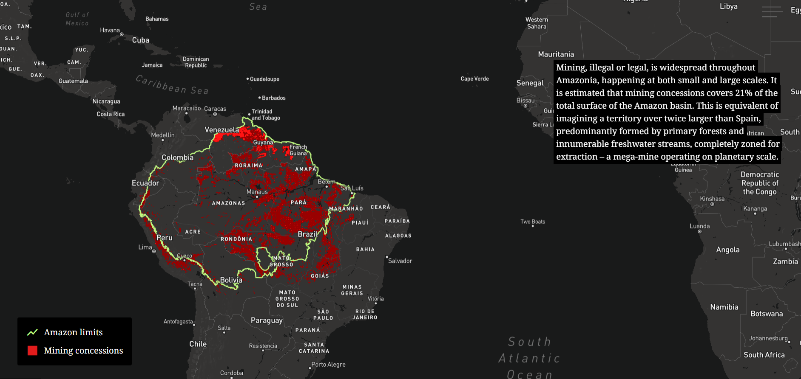

Trecho de narrativa através de mapas da
geohistória
[Expulsions](https://www.google.com/url?q=https://documental.xyz/expulsions/&sa=D&source=editors&ust=1786675075230059&usg=AOvVaw0hVDprqb8ZPohT0M8qrhmR)

## 

## 1.1 O que você encontra neste guia

 

|                                                             |                                                                                                                                      |
| ----------------------------------------------------------- | ------------------------------------------------------------------------------------------------------------------------------------ |
| Capítulo               | Conteúdo                                                                                        |
| 1. A Documental                | Introdução à plataforma e ao guia                                                                           |
| 2. Primeiro acesso             | Instalação do aplicativo, criação da conta e do repositório no GitHub, e montagem do ambiente de trabalho   |
| 3. Preparando o mapa no Mapbox | Organização e envio dos dados geográficos, criação e personalização do mapa, e sua conexão com a Documental |
| 4. Criando uma história        | Configuração da página, das vistas de mapa e montagem do conteúdo, com a biblioteca completa de blocos      |
| 5. Publicando uma história     | Publicação pelo GitHub Pages, por servidor próprio ou no site da Documental                                 |
| 6. Técnicas de scrollytelling  | Alternativas, tecnologias e estratégias para narrativas com scrollytelling baseadas em mapas                |
| 7. Problemas comuns            | Problemas frequentes e como resolvê-los                                                                     |
| 8. Como colaborar              | Informações para quem quiser contribuir com o projeto                                                       |
| 9. Referências e recursos      | Compilado de materiais externos úteis                                                                       |
| 10. Equipe                     | Pessoas e organizações envolvidas com a Documental                                                          |

 

## 1.2 Para quem esta documentação se destina

Qualquer pessoa interessada pode ler a documentação
sobre a ferramenta. Porém, para implementar uma instância da plataforma
"do zero" e publicar uma história usando os recursos da Documental, é
recomendável que uma ou mais pessoas tenham conhecimento técnico sobre
noções básicas de manipulação de dados geográficos.

A plataforma foi elaborada para atender à comunidade de
direitos humanos – movimentos
sociais, organizações civis, agências jornalísticas e ONGs
–, não necessariamente
familiarizada com programação web.

## 1.3 Preciso pagar?

A Documental é uma solução baseada em softwares de
código aberto. Para executar a plataforma localmente é necessário
instalar o aplicativo da Documental, que executa o Sveltia (CMS) no seu
computador, criar uma conta gratuita no GitHub e uma conta gratuita no
Mapbox. Para publicar uma página, você configura uma hospedagem gratuita
através do GitHub Pages, embora também possa contratar um
servidor.

O Mapbox adota um modelo
freemium, em que é
possível usufruir de certas soluções com uma conta gratuita, mas é
preciso assinar um serviço pago para obter recursos mais avançados. Os
recursos gratuitos ou de código aberto são suficientes para configurar
uma instância da plataforma e a
versão gratuita do Mapbox serve para a maioria dos casos.
Para criar uma conta, você vai precisar inserir
seus dados de cobrança – não se preocupe –, você só será cobrado caso
ultrapasse 50 mil acessos ao mapa. 

Características

Mapbox

Plano gratuito

Até 50 mil visualizações do mapa por mês

Valor do plano pago

A partir de 50 dólares por mês, ou sob demanda,
dependendo dos serviços utilizados e da quantidade de acessos

Funcionalidades pagas

Mais camadas, mais visualizações de mapas, suporte,
entre outras

Para mais informações sobre os recursos pagos, confira
a página do
[Mapbox](https://www.google.com/url?q=https://www.mapbox.com/pricing&sa=D&source=editors&ust=1786675075250525&usg=AOvVaw1Mwn7RWygzI-WKYAZG4lmy),
e para maiores informações sobre cobranças, acesse o
[FAQ](https://www.google.com/url?q=https://docs.mapbox.com/accounts/faq/how-does-pay-as-you-go-billing-work/&sa=D&source=editors&ust=1786675075250985&usg=AOvVaw3wopsGNUDW5Hw8y0ondfuS).

## 1.4 Como creditar o projeto

Solicitamos que projetos que façam uso da plataforma
incluam a seguinte menção, como forma de apoiar o desenvolvimento da
plataforma:

powered by Documental.xyz

## 1.5 Glossário

Alguns termos aparecem ao longo de todo o guia. Vale
conhecê-los uma vez – você pode voltar a esta página sempre que
precisar.

 

### Código-fonte

O conjunto de arquivos que compõem um programa,
escritos em linguagem de programação. É a receita a partir da qual o
software funciona. Dizer que a Documental é de código aberto significa
que esses arquivos são públicos: qualquer pessoa pode lê-los, copiá-los,
modificá-los e redistribuí-los.

### Repositório Template

Um repositório git com a estrutura mínima para você criar seu
próprio ambiente de trabalho Documental e armazenar e publicar seus
conteúdos.

### GitHub

Plataforma online onde ficam armazenados os códigos.
Funciona como um serviço de nuvem, com uma diferença importante: guarda
todas as versões de cada arquivo, registrando o que mudou, quando e por
quem. É onde o código da Documental está publicado e onde a sua história
fica salva.

### Repositório

A pasta de um projeto dentro do GitHub. Cada ambiente
de trabalho da Documental corresponde a um repositório seu. Ele pode ser
público, visível para qualquer pessoa, ou privado, restrito a você e a
quem você convidar.

### GitHub Pages

Serviço gratuito do GitHub que transforma os arquivos
de um repositório em um site acessível na internet. Você não contrata
hospedagem, não configura servidor e não paga nada: o GitHub monta a
página e a coloca no ar. O endereço segue o formato
https://seu-usuario.github.io/nome-do-repositorio/, e é possível
contratar um domínio próprio para utilizar no lugar.

### Ambiente de trabalho

A sua área de trabalho na Documental, criada em dois
lugares ao mesmo tempo: uma pasta no seu computador, onde você edita, e
um repositório no GitHub, onde tudo fica guardado e versionado. Dentro
de um mesmo ambiente é possível ter várias geohistórias.

### Aplicativo Documental

É a maneira mais simples de usar a plataforma Documental. Com o
aplicativo você pode criar sua conta GitHub, criar e gerenciar seus
repositórios e ambientes de trabalho e publicar seus conteúdos. Uma vez
criado seu ambiente de trabalho, o aplicativo permite que você possa
trabalhar sem internet.

### Mapbox

Serviço online de mapas utilizado pela Documental. É
onde você sobe os seus dados geográficos, monta as camadas e define o
estilo visual do mapa. A Documental se conecta a ele por meio de duas
informações: o estilo do mapa e um token de acesso.

-----

# 2. Primeiro acesso

A Documental é baseada em uma filosofia de código aberto:
seu funcionamento parte da cópia do template do projeto
para o seu repositório pessoal no GitHub, e, a
partir dessa cópia, é possível modificar o conteúdo e a estrutura das
páginas, adaptando-as às necessidades de cada narrativa.

O GitHub consiste numa plataforma online que permite
armazenar, versionar e publicar códigos de forma colaborativa. Ao
carregar arquivos no GitHub, você os armazena num repositório Git, que
tem suas alterações monitoradas pela plataforma.

Você não precisa aprender a usar o GitHub para trabalhar com a
Documental. Quem conversa com ele é o aplicativo que você instala no seu
computador: é ele que cria a sua conta e o repositório, faz
uma cópia do template da Documental, cria um arquivo da
Documental no seu computador, registra cada alteração e faz upload
online da história quando você decide publicar. 

Existem três caminhos para publicar uma história da
Documental: através do GitHub Pages, de um servidor próprio, ou no
servidor da agência autônoma em projetos de colaboração. Essas
informações estão detalhadas no capítulo 5,
Publicando uma história.

As seções a seguir percorrem o caminho completo
dentro do aplicativo, da instalação à criação do seu primeiro
projeto.

|                                                                                                                                                                                                                                                                                                          |
| -------------------------------------------------------------------------------------------------------------------------------------------------------------------------------------------------------------------------------------------------------------------------------------------------------- |
| Em resumo, o caminho é este: instalar o aplicativo → criar ou conectar sua conta do GitHub, pelo próprio aplicativo → criar o ambiente de trabalho, escolhendo o repositório e a pasta local → escrever a história → publicar.  |

## 2.1 Instale o aplicativo

Para começar a usar a Documental, é necessário instalar
o aplicativo que executa o Sveltia em seu computador. O
link para download está
disponível
[aqui](https://www.google.com/url?q=http://documental.xyz/download&sa=D&source=editors&ust=1786675075267363&usg=AOvVaw0pD5_cHi7R1r1Ba726vQBH) e
na [página inicial da
Documental](https://www.google.com/url?q=https://documental.xyz/&sa=D&source=editors&ust=1786675075267667&usg=AOvVaw0ogDNh9N-vZhNdF2Fg4rCS).
Depois de fazer o download, execute o arquivo.

### Observações por sistema operacional

O aplicativo não possui assinatura digital paga, o que faz com que
Windows e macOS exibam avisos de segurança na primeira execução. Não é
sinal de problema com o arquivo, é o comportamento padrão desses
sistemas para qualquer programa distribuído fora das lojas oficiais.
Veja abaixo como proceder em cada sistema – depois de autorizado uma
vez, o aplicativo abre normalmente.

Sistema

O que pode aparecer

O que fazer

Windows

Tela azul "O Windows protegeu o computador"

Clique em "Mais informações" e depois em "Executar
assim mesmo"

macOS

Aviso de "desenvolvedor não identificado" ou de que o
app não pôde ser verificado

Tente abrir o aplicativo uma vez e feche o aviso.
Depois vá em Ajustes do Sistema ›
Privacidade e Segurança, role até a seção
Segurança e clique
em "Abrir mesmo
assim". Em versões mais antigas do macOS,
também funciona clicar no aplicativo com o botão direito (ou Control +
clique) e escolher "Abrir"

Linux

O arquivo AppImage não executa

No terminal, torne-o executável com chmod +x antes de
rodar

Em seguida, siga os passos indicados pelo aplicativo.
Você vai precisar conectar a sua conta do GitHub e autorizar a
instalação de algumas dependências para que o aplicativo
funcione.

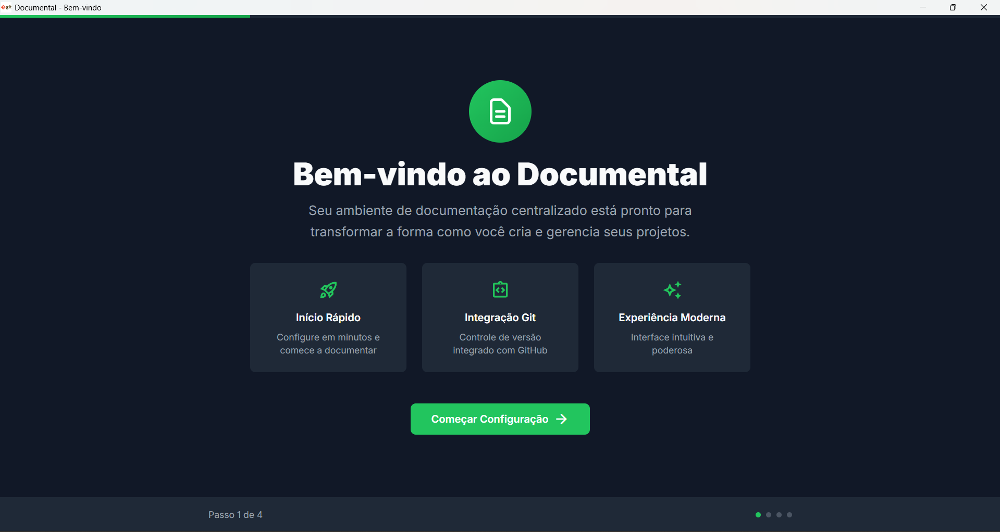[\[c\]](#cmnt3)[\[d\]](#cmnt4)

Tela de abertura do aplicativo.

## 2.2 Crie sua conta e seu repositório no GitHub

Para construir uma geohistória, você precisa de uma conta e de um
repositório no GitHub. O repositório é a pasta do seu projeto dentro do
GitHub: é para lá que o template da Documental
é copiado, e é lá que a sua história fica guardada, com o histórico de
alterações. Isso vale mesmo que você opte depois por publicar as páginas
em outro serviço.

Ao abrir o aplicativo pela primeira vez, ele conduz você por toda
a configuração inicial: criar ou conectar a conta do GitHub, autorizar o
acesso e instalar as dependências necessárias para o funcionamento da
plataforma. Basta seguir os passos indicados na
tela:[\[e\]](#cmnt5)[\[f\]](#cmnt6)

Se você ainda não tem conta no GitHub, o próprio aplicativo abre o
cadastro – é gratuito e leva poucos minutos, exigindo apenas um e-mail e
uma senha. Se já tem, é só conectá-la neste mesmo passo.  

|                                                                                                                                                                                                                                                                                                                                                                                    |
| ---------------------------------------------------------------------------------------------------------------------------------------------------------------------------------------------------------------------------------------------------------------------------------------------------------------------------------------------------------------------------------- |
| Sobre segurança: a credencial de acesso é guardada no cofre de senhas do seu sistema operacional – Chaveiro no macOS, Gerenciador de Credenciais no Windows, keyring no Linux –, nunca em arquivo de texto aberto. Você pode revogar o acesso a qualquer momento em github.com, na seção Settings › Applications. |

<table>
<colgroup>
<col style="width: 100%" />
</colgroup>
<tbody>
<tr class="odd">
<td>
Após logar com sua conta pela primeira vez: quando você entrar de novo no aplicativo, você não precisará mais logar novamente. Mas, caso queira acessar o aplicativo com outra conta Github, fecha o aplicativo, e, com ele fechado,  remova a pasta de configuração. Em cada sistema operacional há um caminho diferente. Veja abaixo:

MacOS 
~/Library/Application Support/Documental 
 
OBS: ~/Library é uma pasta oculta no Finder.  Para acessá-la, pressione ⌘ + Shift + G e digite: ~/Library/Application Support/

Windows

C:\\Usuários\&lt;seu_usuário&gt;\AppData\Roaming\Documental 
 
OBS: AppData é uma pasta oculta no explorer. Para acessá-la: 
Windows 11: Exibir → Mostrar → Itens ocultos.

Windows 10: guia Exibir → marque Itens ocultos.

 
LINUX 
- ~/.config/Documental

 
OBS: .config é uma pasta oculta no Linux por padrão. Na maioria dos gerenciadores de arquivo basta pressionar CRTL+h para visualizar ou ocultar
</td>
</tr>
</tbody>
</table>

## 

## 2.3 Criando o seu ambiente de trabalho

Depois de concluir a configuração inicial, você acessa
a página de edição da Documental, com três caminhos possíveis: Criar
Novo Ambiente de Trabalho; Abrir Pasta e Abrir Recente:

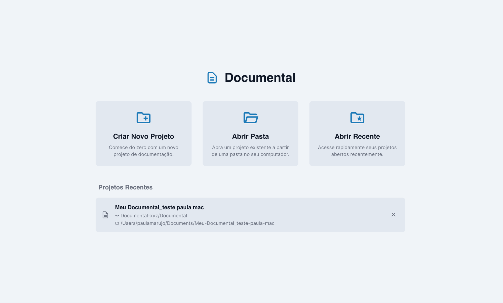

Tela de criação de novo ambiente de trabalho no
aplicativo[\[g\]](#cmnt7)

Como este é o seu primeiro acesso, clique em
Criar Novo Projeto – é
por aí que se cria o seu ambiente de trabalho.

<table>
<colgroup>
<col style="width: 100%" />
</colgroup>
<tbody>
<tr class="odd">
<td>
O que é o ambiente de trabalho

O ambiente de trabalho é a sua pasta de trabalho na Documental. Ele é criado em dois lugares ao mesmo tempo: numa pasta do seu computador e dentro do seu repositório no GitHub, onde tudo fica guardado e versionado. São as duas faces da mesma coisa, e o aplicativo mantém as duas em sincronia.

Dentro de um mesmo ambiente você pode ter várias geohistórias – não é preciso criar um ambiente novo a cada história.

Ao criar o ambiente, o aplicativo faz uma cópia do template da Documental para o seu repositório. É essa cópia que traz a estrutura pronta da plataforma, que você vai preencher com o seu conteúdo.
</td>
</tr>
</tbody>
</table>

### Escolhendo o repositório

O aplicativo pede que você indique o repositório do
GitHub onde a documentação será salva e publicada.

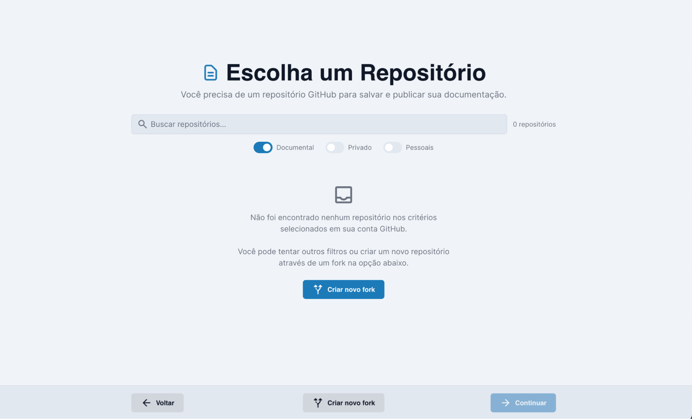[\[h\]](#cmnt8)[\[i\]](#cmnt9)

Tela de escolha do repositório, com os filtros de
busca e a opção de criar uma cópia do template da Documental.

A tela lista os repositórios da sua conta do GitHub e
traz três filtros:

|                                             |                                                                                                                                               |
| ------------------------------------------- | --------------------------------------------------------------------------------------------------------------------------------------------- |
| Filtro | O que faz                                                                                                |
| Documental     | Mostra apenas repositórios da Documental. Deixe ligado se você já tem um ambiente criado e quer encontrá-lo na lista |
| Privado        | Inclui na busca os repositórios privados                                                                             |
| Pessoais       | Restringe a busca aos repositórios da sua conta pessoal                                                              |

No primeiro acesso, nenhum repositório aparece – é esperado, você
ainda não tem nenhum. Use o botão Criar
novo. 

Com o repositório selecionado, clique em
Continuar. Em seguida,
o aplicativo pede o nome do ambiente e a pasta do seu computador onde os
arquivos ficarão.

### Definindo os detalhes do ambiente

O aplicativo abre a tela Criar Novo
Ambiente de Trabalho, onde você define como e
onde o ambiente será criado.

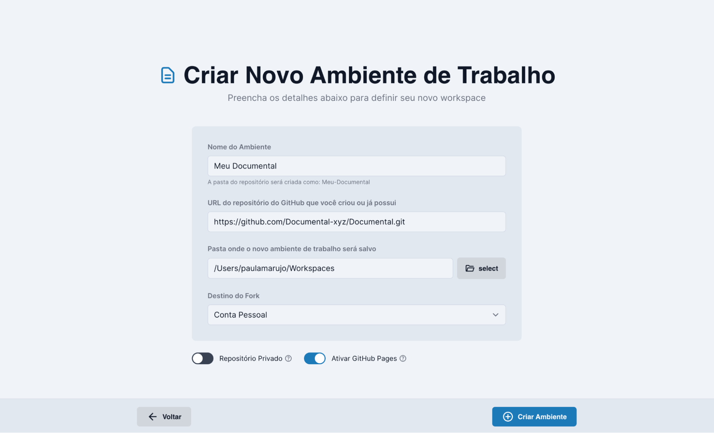[\[j\]](#cmnt10)[\[k\]](#cmnt11)

Tela de criação do ambiente de trabalho.

|                                                                                |                                                                                                                                                   |
| ------------------------------------------------------------------------------ | ------------------------------------------------------------------------------------------------------------------------------------------------- |
| Campo                                     | O que informar                                                                                               |
| Nome do Ambiente                                  | O nome do seu ambiente de trabalho. Logo abaixo do campo, o aplicativo mostra como a pasta será criada                   |
| URL do repositório do GitHub                      | O endereço do repositório que você selecionou ou criou no passo anterior. O campo já vem preenchido automaticamente      |
| Pasta onde o novo ambiente de trabalho será salvo | A pasta do seu computador onde os arquivos ficarão. Use o botão select para escolher                                     |
| Destino do novo repositório                       | Onde a cópia do repositório da Documental será criada: na sua conta pessoal ou em uma organização da qual você participa |

 

|                                                                                                                                                                                                                                                                                                                                                                    |
| ------------------------------------------------------------------------------------------------------------------------------------------------------------------------------------------------------------------------------------------------------------------------------------------------------------------------------------------------------------------ |
| Escolha bem a pasta local: é nela que sua história estará armazenada enquanto você trabalha. Vale incluí-la nos seus backups e evitar pastas sincronizadas automaticamente por outros serviços de nuvem, como Dropbox ou Google Drive, que podem entrar em conflito com o controle de versões do Git. |

<table>
<colgroup>
<col style="width: 100%" />
</colgroup>
<tbody>
<tr class="odd">
<td>
A escolha do seu repositório: vale a pena consultar mais informações sobre <a href="https://www.google.com/url?q=https://docs.github.com/pt/repositories/creating-and-managing-repositories/about-repositories%23about-repository-ownership&amp;sa=D&amp;source=editors&amp;ust=1786675075310994&amp;usg=AOvVaw3kduBpeVKMrHh10db9iUi5" class="c49">onde criar o seu repositório no GitHub</a>. Ele pode ser vinculado diretamente à sua conta pessoal, pode ser criado dentro de uma organização, ou ser organizado dentro de subpastas. Essa escolha é importante para organizar suas geohistórias na plataforma, e também pode influenciar no endereço do site, caso você opte por publicá-las por meio do GitHub Pages.

</td>
</tr>
</tbody>
</table>

Abaixo dos campos há duas chaves de
configuração:

|                                                  |                                                                                                                                                                                                                        |
| ------------------------------------------------ | ---------------------------------------------------------------------------------------------------------------------------------------------------------------------------------------------------------------------- |
| Opção       | O que faz                                                                                                                                                                         |
| Repositório Privado | Deixa o repositório fechado, visível apenas para você e para quem você convidar                                                                                                               |
| Ativar GitHub Pages | Deixa a publicação do site já configurada. Com a chave ligada, o GitHub monta e coloca a página no ar sozinho a cada publicação, sem que você precise mexer nas configurações do repositório. |

 

Sobre a chave Ativar GitHub
Pages: o GitHub Pages é o serviço gratuito que
transforma os arquivos do seu repositório em um site acessível na
internet. Com a chave ligada, o aplicativo já deixa tudo preparado, e a
cada vez que você publicar o GitHub monta o site sozinho e o coloca no
ar. É o mesmo resultado do passo a passo descrito no capítulo 5, feito
automaticamente para você.

Desligar a chave não impede nada do seu trabalho – o ambiente
funciona igual e você escreve normalmente. O que muda é que o site não
vai ao ar até que você configure a publicação à mão, ou opte por
hospedar a história em servidor próprio. Na dúvida, deixe ligada: é
sempre possível desativar depois.

 

<table>
<colgroup>
<col style="width: 100%" />
</colgroup>
<tbody>
<tr class="odd">
<td>
Atenção ao combinar as duas: em contas gratuitas do GitHub, repositórios privados não podem ser publicados pelo GitHub Pages. No plano gratuito, portanto, publicar significa necessariamente deixar os arquivos da história visíveis.

O que "repositório público" significa na prática: não se trata apenas de alguém digitar o endereço certo. Repositórios públicos aparecem na busca do GitHub e são indexados por buscadores; o histórico completo de alterações fica visível, inclusive trechos e arquivos que você tenha apagado depois; e, como o ambiente é criado a partir de um template, ele aparece na lista pública de cópias do repositório da Documental.

Nada disso impede o trabalho – a maioria das geohistórias é feita justamente para circular. Mas se houver material sensível antes da publicação, como nomes de fontes, localizações precisas ou documentos ainda não verificados, vale considerar um plano pago do GitHub, hospedagem em servidor próprio, ou simplesmente manter esse material fora do repositório até a hora de publicar.
</td>
</tr>
</tbody>
</table>

 

Por fim, clique em Criar
Ambiente. A primeira criação leva alguns
minutos: é quando o aplicativo faz a cópia do template da Documental
para seu repositório, ou seja, copia automaticamente os arquivos para a
sua pasta e prepara o ambiente de edição.

### Voltando ao aplicativo depois

Criado o ambiente, os outros dois caminhos da página
inicial passam a fazer sentido:

|                                              |                                                                                                                       |
| -------------------------------------------- | --------------------------------------------------------------------------------------------------------------------- |
| Caminho | Quando usar                                                                      |
| Abrir Pasta     | O ambiente já está no seu computador e você quer localizá-lo manualmente, escolhendo a pasta |
| Abrir Recente   | Você quer voltar rapidamente a um ambiente em que já estava trabalhando                      |

 

Abaixo dos três cartões fica a lista
Ambientes Recentes, com
os três ambientes mais recentes. Cada item mostra o nome, o repositório
do GitHub ao qual está ligado e o caminho da pasta no seu computador. O
“X” à direita apenas remove o item da lista — não apaga nada, nem na
sua máquina nem no GitHub.

Você também usa Criar Novo Ambiente
quando quiser montar um ambiente para um repositório que já
existe, ao trocar de computador, por
exemplo. Nesse caso, em vez de criar um novo
template, basta selecionar o repositório na lista — deixando o filtro
Documental ligado para encontrá-lo mais facilmente. 

Para os próximos passos sobre como criar uma história, veja
a seção 4. Criando uma história.

2.4 Trabalhando offline

Depois que o ambiente de
trabalho é criado, você não precisa mais de
internet para escrever. Tudo o que você faz
– texto, imagens, ajustes de mapa
– é gravado nos arquivos da pasta
local do seu computador. A conexão volta a ser
necessária em dois momentos:

  - Para fazer upload ou modificações nos
    mapas, acessando o site do
    Mapbox;
  - Na hora de publicar.

Isso torna a plataforma viável em situações de campo,
conexão instável ou trabalho em territórios com pouca infraestrutura:
você produz a história onde estiver e publica quando encontrar
rede.

-----

# 3. Preparando o mapa no Mapbox

O Mapbox
Studio consiste numa plataforma em que você fará
o upload dos dados geográficos com os
quais quiser trabalhar. Ele funciona como um
"Photoshop para mapas", segundo o site oficial da empresa. Existe,
então, um fluxo de trabalho de criar os dados, organizar os dados, e
depois exportá-los para a plataforma.

Atualmente, o Mapbox Studio aceita o
formato GeoTIFF para
arquivos em malha (raster) e diversos outros para dados vetoriais
(MBTiles, KML, GPX, GeoJSON, Shapefile zipado ou tabelas CSV). Você pode
usar uma solução online e de código aberto como o
[QGIS](https://www.google.com/url?q=https://qgis.org&sa=D&source=editors&ust=1786675075331630&usg=AOvVaw0mjtDvxgHvr2HjnkDabtLc) ou
o
[Mapshaper](https://www.google.com/url?q=https://mapshaper.org/&sa=D&source=editors&ust=1786675075331955&usg=AOvVaw2HLKy5ohiQDveTREYEQTw6) para
criar os seus geodados ou para
fazer conversão de formatos.

Você também pode criar os seus dados diretamente dentro
do Mapbox, através da criação de um Dataset
– porém softwares como o QGIS são
mais completos em termos de ferramentas para a criação e edição desses
dados.

## 3.1 Boas práticas na organização dos dados

Antes de enviar qualquer coisa para o Mapbox, vale
organizar os dados. Algumas decisões tomadas nesta etapa evitam bastante
retrabalho depois.

O Mapbox guarda os dados geográficos
em[ ](https://www.google.com/url?q=https://docs.mapbox.com/console-tools/data-workbench/&sa=D&source=editors&ust=1786675075334150&usg=AOvVaw0bIR9Qga5uaQf7LphPCA4j)[Data
Workbench](https://www.google.com/url?q=https://docs.mapbox.com/console-tools/data-workbench/&sa=D&source=editors&ust=1786675075334417&usg=AOvVaw1VAeFAXBKjhAGJapqHphs7),
e os intitula de
[tilesets](https://www.google.com/url?q=https://docs.mapbox.com/help/glossary/tileset/&sa=D&source=editors&ust=1786675075334704&usg=AOvVaw1F1SLEowbXe-W0uETGsfQe).
Um tileset é um conjunto de dados recortado em pequenos quadrados em
vários níveis de zoom, de modo que o mapa carregue apenas os pedaços da
área visível – o que o deixa rápido no navegador e no celular.

Duas restrições do Mapbox orientam a forma de organizar
o material:

•    A versão
gratuita permite o upload de 15 tilesets por mapa. Isso não significa
apenas 15 dados: um tileset é uma coleção e pode reunir mais de um
geodado.

•    Cada tileset
aceita um único tipo de geometria. Na prática, isso significa separar o
material em tilesets distintos – um com polígonos, outro só com pontos,
outro só com linhas.

Duas boas práticas ajudam bastante daqui em
diante:

•    Verifique se
todos os dados geográficos estão numa mesma projeção geográfica.

•    Adote um
padrão consistente para nomear os arquivos. Isso facilita a manipulação
quando há muitos dados de uma vez só. Inclusive, considere utilizar a
nomenclatura para diferenciar os tilesets por projeto, pois os tilesets
de todos os seus projetos do Mapbox estarão juntos na mesma
pasta.

## 3.2 Enviando seus dados para o Mapbox

Com os dados organizados, crie uma conta gratuita
no[ ](https://www.google.com/url?q=https://www.mapbox.com/&sa=D&source=editors&ust=1786675075338640&usg=AOvVaw3ChICFTsh4un_xQGAKt9MS)[Mapbox](https://www.google.com/url?q=https://www.mapbox.com/&sa=D&source=editors&ust=1786675075338822&usg=AOvVaw0CNPV5mMmTcxXhmPTLO2KA) e
faça o upload deles.

No Mapbox Studio, abra a aba Data
Workbench e clique no botão
Upload – uma janela se
abre para você selecionar o arquivo no seu computador. O Mapbox processa
o arquivo e, ao terminar, ele passa a aparecer na sua lista de dados,
pronto para ser usado nos mapas.

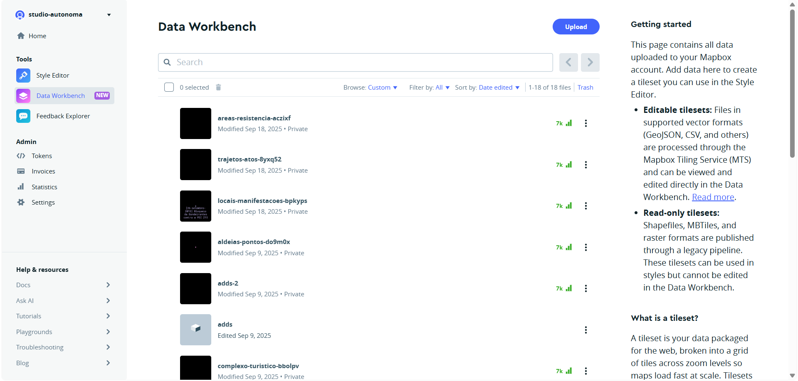

Aba de Data Workbench do Mapbox.
Upload é o
botão em que você realiza o upload de arquivos.

## 3.3 Criando um novo mapa

Com os dados organizados e enviados, o próximo passo é montar o
mapa. Ele começa pelo estilo do mapa base – a camada que, em geral, fica
abaixo das demais e serve de referência visual. No Mapbox Studio, você
pode criar um estilo novo pelo botão azul New
style ou duplicar um estilo já existente.  

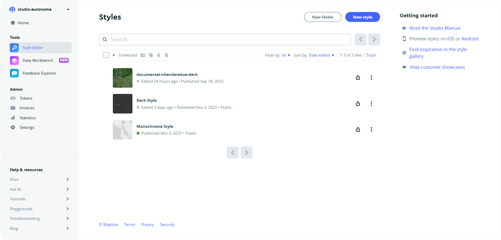

Criação de um novo estilo de mapa no Mapbox
Studio.

### Três caminhos para o estilo base

Você tem três opções. A ordem abaixo vai da mais
simples à mais trabalhosa – e a última traz uma limitação
importante.

#### 1. Copiar um dos estilos da agência autônoma (recomendado)

A agência autônoma possui dois estilos públicos, já
configurados para funcionar bem com a Documental: o
Monochrome Style e o
Dark Style. Você copia
um deles para a sua conta e monta o seu mapa por cima, adicionando as
suas camadas de dados ao estilo já pronto – sem começar do zero e sem
abrir mão de nenhum recurso da plataforma. É o caminho mais rápido para
quem está começando.

|                                             |                                                                                                                                                                                                                                                                                               |
| ------------------------------------------- | --------------------------------------------------------------------------------------------------------------------------------------------------------------------------------------------------------------------------------------------------------------------------------------------- |
| Estilo | URL                                                                                                                                                                                                                                                      |
| Monochrome Style   | https://api.mapbox.com/styles/v1/studio-autonoma/cmdgcs27u019101sa29ytbsps.html?title=copy\&access\_token=pk.eyJ1Ijoic3R1ZGlvLWF1dG9ub21hIiwiYSI6ImNtY3V2d3dtMTA0ZXgycnB4OW01cjlqb2QifQ.3NMaRt1maLlqTv6nlVqVHA\&zoomwheel=true\&fresh=true\#9/37.78/-122.4241        |
| Dark Style         | https://api.mapbox.com/styles/v1/studio-autonoma/cmdgcp72i003701qw07pk8bo3.html?title=copy\&access\_token=pk.eyJ1Ijoic3R1ZGlvLWF1dG9ub21hIiwiYSI6ImNtY3V2d3dtMTA0ZXgycnB4OW01cjlqb2QifQ.3NMaRt1maLlqTv6nlVqVHA\&zoomwheel=true\&fresh=true\#13.11/-3.57334/-78.46903 |

   
Consulte
a[ ](https://www.google.com/url?q=https://docs.mapbox.com/help/dive-deeper/transfer-styles-between-accounts/&sa=D&source=editors&ust=1786675075349837&usg=AOvVaw1A8cc_xPjrtmJLDYpAZ1mC)[documentação
do Mapbox sobre como copiar um estilo de outra conta para a
sua](https://www.google.com/url?q=https://docs.mapbox.com/help/dive-deeper/transfer-styles-between-accounts/&sa=D&source=editors&ust=1786675075350397&usg=AOvVaw15UehisdsLbj7ysr_kRaZA).  

#### 2. Criar do zero (Start from scratch)

Você monta o mapa camada por camada, escolhendo o que
aparece e como aparece. Obtém controle total sobre o resultado e mantém
todos os recursos da Documental funcionando, mas exige mais tempo e
alguma familiaridade com o Mapbox Studio.

#### 3. Mapbox Standard

É o estilo pronto da própria Mapbox e vem com outros elementos não
disponíveis no estilo da autônoma,
como edifícios em três dimensões, relevo e variações de iluminação. É
uma opção rápida para ter um mapa bonito sem configurar nada.

A contrapartida é que as camadas do Standard vêm empacotadas pela
Mapbox e não podem ser manipuladas uma a uma, então, não é possível
editar as camadas que constituem o mapa Standard do Mapbox, como é
possível editar através do mapa básico disponibilizado
pela autônoma, ou desenvolvido do
zero. Além disso, o uso do Mapbox Standard compromete algumas
funcionalidades de produção de mapas da Documental, como a filtragem de
layers. Se os seus mapas forem mais complexos e você quiser fazer uso de
atributos para definir qual camada aparecerá no seu mapa naquele
momento, essa funcionalidade da Documental estará comprometida. É uma
limitação do próprio Mapbox, não da Documental.

Vale a pena considerar essa opção se a sua narrativa é
composta de estruturas de camadas mais simples, e não depende da
filtragem de camadas através dos seus atributos.

 

|                                                                                                                                                                                                                                                                                                                                                                                                                                                                                                                                                 |
| ----------------------------------------------------------------------------------------------------------------------------------------------------------------------------------------------------------------------------------------------------------------------------------------------------------------------------------------------------------------------------------------------------------------------------------------------------------------------------------------------------------------------------------------------- |
| O que são filtros: um geodado não é apenas um desenho – cada elemento dentro dele, cada ponto ou polígono, carrega atributos, como nome, ano, área ou categoria. Filtrar é usar esses atributos para escolher o que aparece: de um tileset com todos os municípios do país, exibir apenas os de um estado; de uma camada com registros de vários anos, mostrar só os de 2024. Os atributos vêm dos próprios dados e podem ser criados e editados no QGIS antes do envio ao Mapbox. |

 

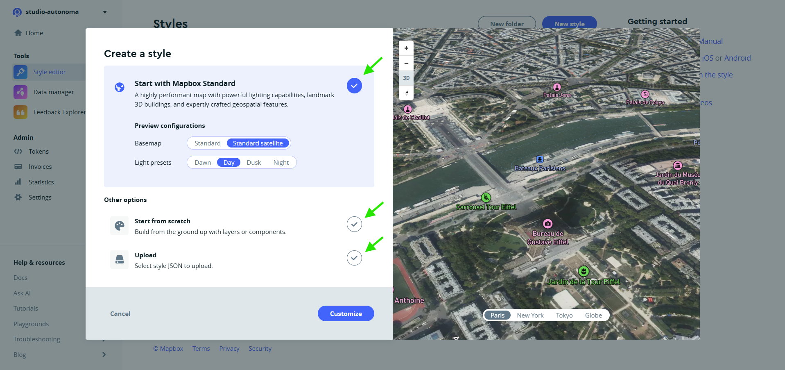

Opções para criar um estilo novo: Mapbox Standard,
criar um estilo do zero (Start from scratch) e fazer o upload de um
estilo existente em JSON (Upload).

## 3.4 Personalizando um mapa

Com o estilo base escolhido, é hora de trazer os seus dados para o
mapa. Eles já estão na sua conta do Mapbox, enviados como tilesets na
etapa 3.2 – mas guardar um dado e exibi-lo em um mapa são coisas
distintas. O tileset é o arquivo armazenado na sua conta; a camada
(layer) é a decisão de mostrar
aquele arquivo
neste mapa, com
determinada cor, espessura e ordem de sobreposição. Um mesmo tileset
pode virar camada em vários mapas diferentes, com aparências distintas
em cada um.

O editor do Mapbox Studio se divide em três áreas, como se pode
ver na imagem abaixo. À esquerda fica a lista de camadas: cada linha é
um conjunto de dados desenhado sobre o mapa, e a ordem da lista define o
que aparece por cima do quê. No centro fica o mapa em si, que mostra o
resultado em tempo real, à medida que você edita. Na barra cinza
inferior ficam as informações de enquadramento – o nível de zoom e as
coordenadas do centro da vista.

Essa barra inferior merece atenção especial, porque é dela que
saem os valores que você vai informar na Documental. Sempre que quiser
reproduzir um enquadramento na sua narrativa, posicione o mapa como
deseja aqui no Studio e anote o zoom, a latitude e a longitude que
aparecem ali.

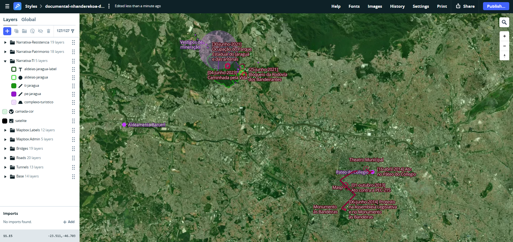

Interface do Mapbox Studio: camadas à esquerda,
zoom e coordenadas na barra inferior.

Para exibir um novo dado no mapa, clique no ícone
+ acima da lista de camadas. Uma
nova camada é criada, e você escolhe qual tileset ela vai mostrar
em Source, no campo
Select data.

Você pode aplicar um filtro ao selecionar o dado. O
filtro pode ser aplicado sobre os atributos associados ao geodado –
atributos que você pode inserir e manipular dentro do QGIS, por exemplo.
A ferramenta de filtragem do Mapbox é útil para
individualizar elementos em camadas, tendo em vista que você tem um
limite de upload de 15 tilesets. Mas cuidado para não abusar: o Mapbox
não funciona bem com muitas camadas.

Vale lembrar que, além desse mecanismo de filtro do Mapbox, você
também consegue fazer filtros em layers dentro da Documental. Ambos os
mecanismos são úteis para narrativas complexas com muitos dados. É
importante mencionar que o mecanismo de filtragem, dentro do Mapbox e
dentro da Documental, não irá funcionar caso seu mapa base for do tipo
Mapbox Standard, como já foi explicado na seção
3.3 Criando um novo mapa.

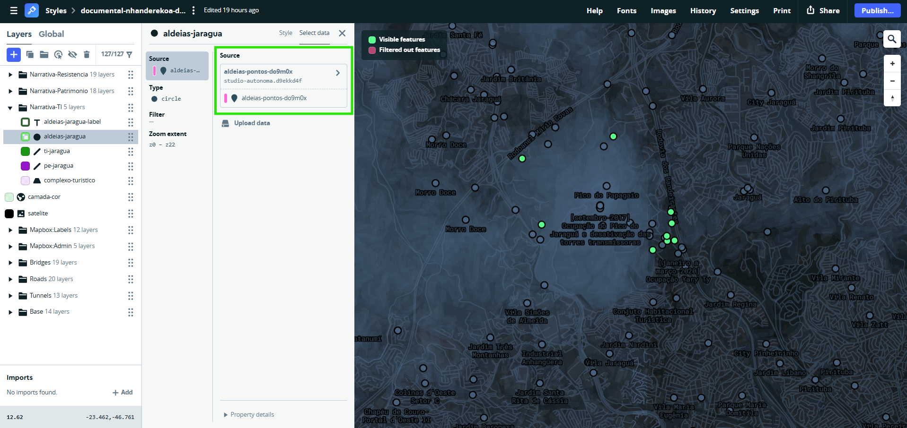

Seleção do geodado em Source, dentro do campo
Select data.

Depois de escolher o geodado, você passa para a aba
Style e configura o
estilo de sua preferência para a camada. Confira a
[documentação](https://www.google.com/url?q=https://docs.mapbox.com/studio-manual/reference/styles/&sa=D&source=editors&ust=1786675075366645&usg=AOvVaw1mc7JGR-0jnLV6iLeb1tFT)[ do
Mapbox](https://www.google.com/url?q=https://docs.mapbox.com/studio-manual/reference/styles/&sa=D&source=editors&ust=1786675075366921&usg=AOvVaw3NrEj7Coc2pvfiJC0YCDjX) para
mais orientações sobre esta etapa.

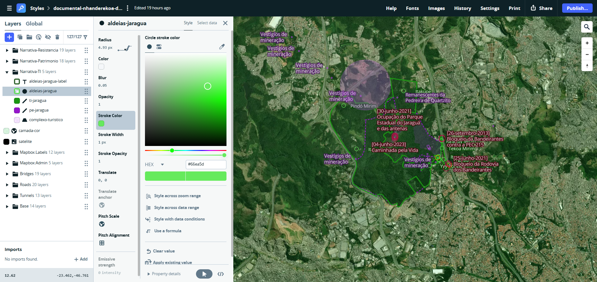

Configuração de estilo da camada.

## 3.5 Conectando o mapa à Documental

Quando o mapa estiver pronto no Mapbox, falta somente dizer à
Documental onde encontrá-lo, e isso é feito com duas
informações que você vai copiar e colar na
página de edição da sua geohistória da Documental, no item
Mapbox (ver
seção 4.6 Modules).

Informação

O que é e exemplo

Mapbox Style

Um caminho do estilo criado no sistema do
Mapbox.

mapbox://styles/usuaria/ckcb6q2pe2b3149s11kk9zr9u

Mapbox Access Token

Uma longa sequência aleatória de caracteres, que serve
como senha para acessar seus dados no Mapbox.

pk.eyJ1IjoibWFybUXQjwiwiYS31IjlmYlhtaEkif2.vMxORYorRKnueDl3c5idQQ

São necessárias as duas porque cada uma responde a uma pergunta
diferente: o style diz qual mapa
carregar, e o token diz de
quem ele é. É pelo token que o Mapbox
contabiliza as visualizações na sua conta – as tais 50 mil mensais do
plano gratuito. Se qualquer uma das duas faltar ou estiver errada, o
mapa aparece em branco na página publicada.

### Onde encontrar as duas

Clique no botão Share, no
canto superior direito do editor do Mapbox Studio. Um quadro se abre, e
ambas as informações estão na seção Developer
resources.

 

|                                                                                                                                                                                                                                                                                                                                                                                                           |
| --------------------------------------------------------------------------------------------------------------------------------------------------------------------------------------------------------------------------------------------------------------------------------------------------------------------------------------------------------------------------------------------------------- |
| Sobre o token: o token que começa com pk. é público, e é feito justamente para ficar visível no código do site – não é uma senha, apesar de parecer uma. O Mapbox também permite criar tokens secretos, que começam com sk. e dão acesso de escrita à sua conta. Esses nunca devem ser usados na Documental, nem publicados em lugar nenhum. |

 

-----

# 4. Criando uma história

Depois de ter criado o ambiente de trabalho (conforme a
seção 2.
Primeiro acesso), você será direcionado para a página de
boas-vindas do app. No menu superior, escolha o modo "edição", no ícone
do lápis, para começar a criar sua história. Clique em
Work with Local Repository \[Trabalhar com seu
repositório local\] e selecione a pasta raiz do
repositório quando solicitado. 

Toda criação de conteúdo permanece em seu computador até que faça
uma publicação. Ao publicar, o app irá sincronizar o conteúdo local em
seu computador com o repositório em sua conta
GitHub, tornando-o acessiveis para edição por outros colaboradores que
acesso ao repositório, ou até mesmo para
visualização final como site no GitHub Pages
ou em seu serviço de hospedagem caso tenha configurado.

[\[l\]](#cmnt12)

### Modos de visualização

Ainda no menu superior, você escolhe como quer
acompanhar o trabalho. São três modos:

|                                           |                                                                                          |
| ----------------------------------------- | ---------------------------------------------------------------------------------------- |
| Modo | O que mostra                                        |
| Edição           | Apenas o painel de edição                                       |
| Geohistória      | Apenas a página da história, como o leitor vai vê-la            |
| Tela dividida    | Os dois lado a lado, para acompanhar o resultado enquanto edita |

 

|                                                                                                                                                                                                                                                                                       |
| ------------------------------------------------------------------------------------------------------------------------------------------------------------------------------------------------------------------------------------------------------------------------------------- |
| As mudanças não aparecem sozinhas: mesmo com a tela dividida, a página da geohistória não se atualiza automaticamente conforme você digita. É preciso salvar a história para ver as alterações refletidas na visualização. |

 

[\[m\]](#cmnt13)[\[n\]](#cmnt14)

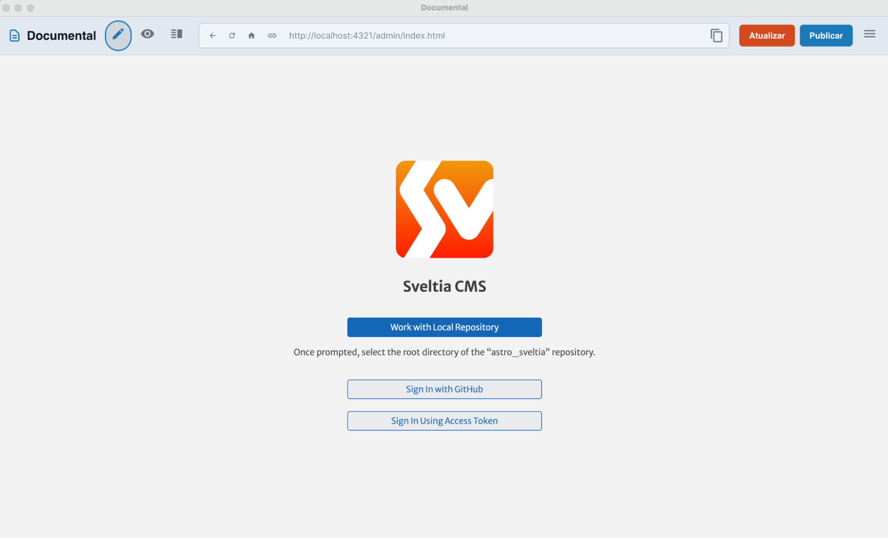

Tela inicial do Sveltia CMS – escolha "Work with
Local Repository" para começar.

## 4.1 Criando a página

Você vai ser direcionado para a página do seu ambiente de
trabalho, onde você vai encontrar todas as suas
histórias (caso já tenha criado ou começado alguma), assim como a
biblioteca de arquivos do seu ambiente de trabalho, onde seu material
audiovisual deverá ser armazenado. 

No canto superior direito, você pode acessar as
configurações do modo de edição, onde poderá escolher o modo claro ou
escuro, assim como outras preferências.

[\[o\]](#cmnt15)[\[p\]](#cmnt16)

As páginas da sua geohistória da Documental podem ser organizadas
por seções. Se a sua história for muito grande (maior do que 15
componentes – ver seção 4.7
Components), ela precisará ser dividida em
subpáginas. Elas estarão todas dentro da mesma seção, conforme a imagem
acima que mostra o projeto Nhanderekoa dividido em 3 páginas de edição.
Para mais informações sobre a divisão de páginas, veja a
próxima
seção 4.2.
Project.

Para criar uma nova história, selecione o botão
Novo no canto superior
direito da tela. Isso abrirá uma tela de edição de geohistórias. 

[\[q\]](#cmnt17)[\[r\]](#cmnt18)

Preencha os campos "Title" e
"Slug" (este
é o endereço que aparece no final da sua URL da documental quando você
cria o repositório =
documental.xyz/slug) –
é importante que esses dois campos tenham valores únicos em relação às
outras geohistórias, pois informações duplicadas podem causar erros na
plataforma.

Abaixo desses campos, encontram-se as
seções Project,
Page Settings, Page Theme, Page Include,
Modules e, por fim, a aba
Components, onde
serão inseridos os blocos que formam o conteúdo da
página. 

|                                                                                                                                                                                                                                                                       |
| --------------------------------------------------------------------------------------------------------------------------------------------------------------------------------------------------------------------------------------------------------------------- |
| O que é o slug: é uma versão do título simplificado, sem espaços, caracteres especiais, acentuação e de preferencia, tudo minúsculo. Exemplo: O slug de "População Ribeirinha" é "populacao-ribeirinha". |

## 4.2 Project \[Projeto\]

## Esse campo é utilizado quando desejar dividir uma página da Documental em subpáginas, ou quando sua geohistória for extensa e precisar de mais de 15 componentes. Para manter a página principal e as subpáginas juntas num grupo só, você preenche o campo Project com o nome desejado para o agrupamento. Esse agrupamento aparecerá na tela de escolha de páginas da Documental, com o nome da página principal e das subpáginas que estão dentro do agrupamento, depois que você também configurar o campo Page Include, na seção 4.5. 

[\[s\]](#cmnt19)

Caso não deseje nem precise dividir sua história em subpáginas,
você pode deixar o campo
Project vazio. 

## 4.3 Page Settings \[Configurações da Página\]

## Este campo reúne as definições gerais da página: idioma, animações, alinhamento do texto e parâmetros de SEO.

### Idioma

## Você pode disponibilizar uma geohistória em mais de um idioma, mas para isso deve duplicar a página no idioma original, traduzi-la, e atribuir um slug diferente. Para disponibilizá-la em outro idioma, selecione no campo Idioma a opção em uma das linguagens disponíveis (PT - Português, EN - Inglês e ES - Espanhol) e indique o slug da página correspondente. Recomendamos que o slug nas páginas em outros idiomas seja o mesmo da página do idioma original mas adicionando um sufixo relacionado. Exemplo: Página principal em português: “nhanderekoa”; Página respectivamente em inglês e espanhol: “nhanderekoa-en”, “nhanderekoa-es”.

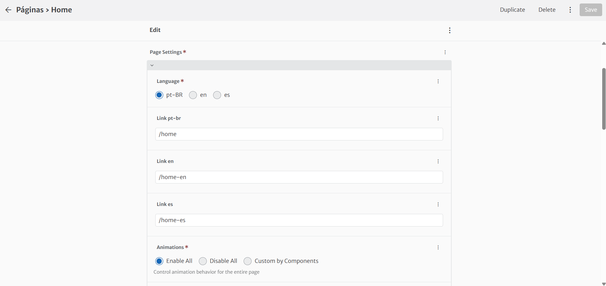

Campo Configurações da Página.

### Animações, alinhamento e SEO

Os blocos da Documental possuem animações em suas configurações,
para que apareçam gradativamente durante a rolagem da página. Também é
possível desativar essa opção e deixar todos os blocos “estáticos”.
Nesse item, é possível controlar se os blocos terão essa
animação ou não,  
  
Há também os parâmetros de SEO (otimização para
mecanismos de busca), que definem como a sua história aparece nos
resultados de pesquisa e quando o link é compartilhado em redes sociais
e aplicativos de mensagem – o título, a descrição e a imagem que
acompanham o endereço. Vale preenchê-los: é o que faz a diferença entre
um link que convida à leitura e um endereço sem contexto.

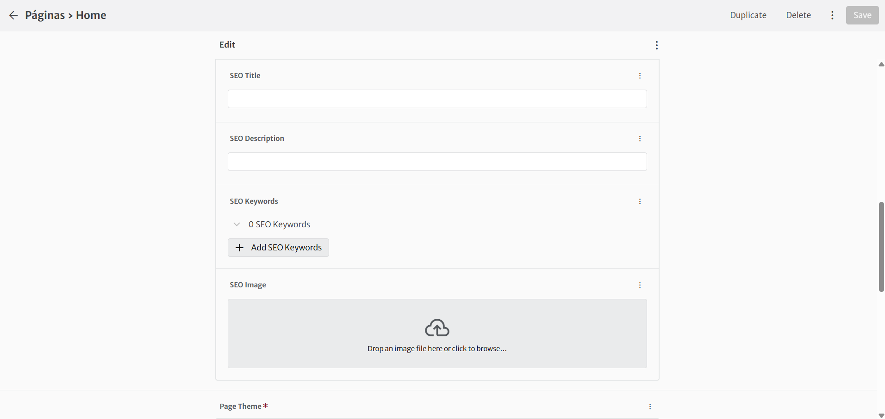

Parâmetros de animação, alinhamento e SEO.

## 4.4 Page Theme \[Tema da Página\]

No campo Tema da
Página, você configura
a paleta de cores que compõe a sua
geohistória. 

Há uma fonte padrão aplicada, mas é possível
personalizá-la inserindo uma fonte do
Google Fonts (ver
seção 4.9 Recursos
Complementares).

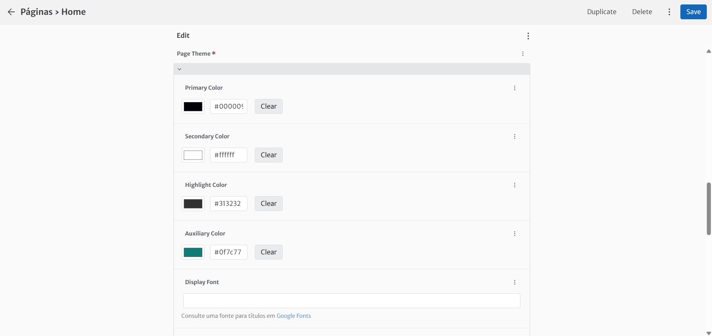

Configuração da paleta de cores.

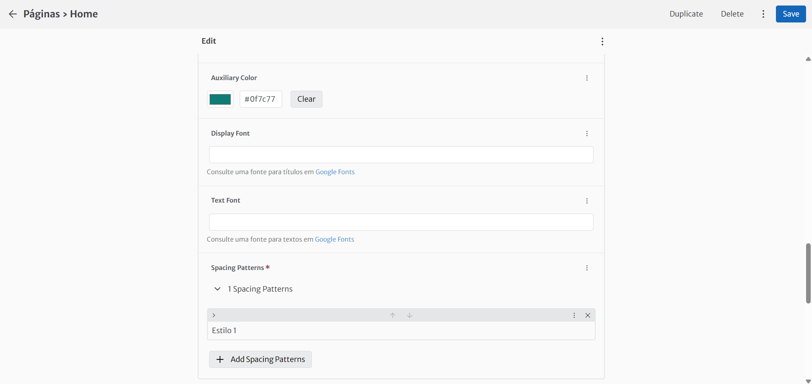

Configuração de fonte e espaçamento entre
linhas.

## 4.5 Page Include \[Inclusão de página\]

### Por que ele existe

O projeto publicado pode ter o tamanho que
a sua geohistória pedir. O que tem limite é a página de edição: cada
página aceita até 15 componentes, para que o editor não fique
pesado.

Quando a história precisa de mais que isso, divide-se o conteúdo
em várias páginas de edição, e o componente
Page Include costura
tudo de volta em uma só na publicação. O leitor não percebe a divisão –
para ele, a narrativa é contínua.

### Como funciona

O Page Include é um componente como os outros, mas não
traz conteúdo próprio: ele chama o conteúdo de outra página. No lugar
onde você o insere, entra tudo o que estiver naquela página.

Há duas formas de organizar essa
divisão.  

  
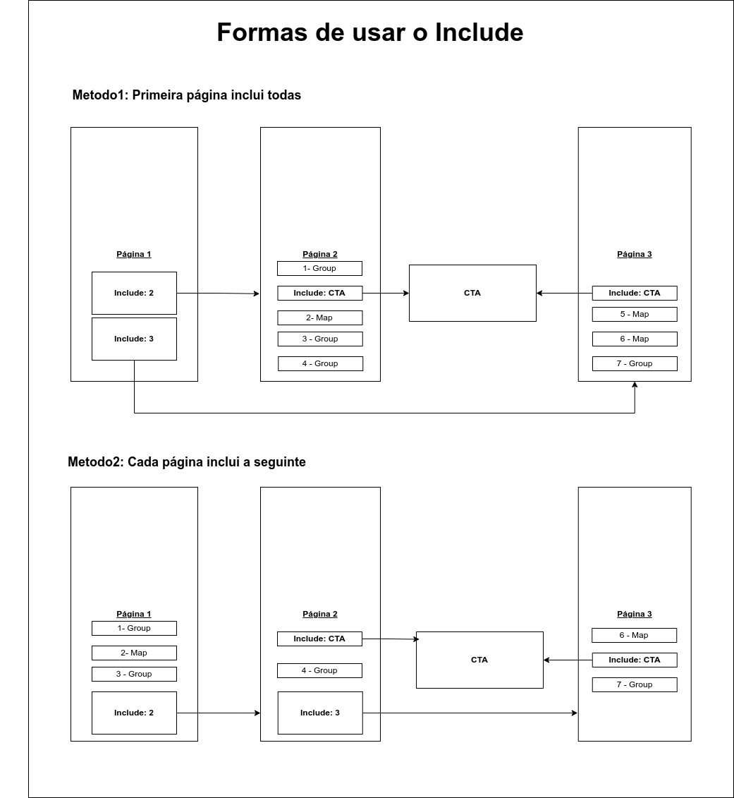

As duas formas de usar o Page Include: uma página
principal que inclui todas as demais, ou páginas encadeadas em que cada
uma inclui a seguinte.

### Método 1 – uma página principal que reúne as demais

Você cria uma página inicial que carrega as configurações da
história – Page Settings, Page Theme
e Modules: Mapbox – e
cujos componentes são apenas os Page
Includes das outras páginas:

- Page Settings

- Page Theme

- Modules: Mapbox

- Components:

        - Page Include: 'pagina1'

    - Page Include: 'pagina2'

Cada página incluída pode ter até 15 componentes. É a
organização indicada quando a história tem capítulos bem definidos: a
página principal funciona como um índice, e permite ver a estrutura
inteira em uma tela e reordenar capítulos.

### Método 2 – páginas encadeadas

Aqui cada página aponta para a seguinte. A primeira
recebe até 14 componentes e, no último lugar, um Page Include indicando
onde a história continua:

- Page Settings

- Page Theme

- Modules: Mapbox

- Components:

        - Group 1

        ...

        - Group 14

    - Page Include: 'pagina2'

São 14, e não 15, porque o próprio Page Include ocupa a
última vaga. É a organização mais próxima da leitura linear, mas não
oferece visão geral: para saber o que vem depois, é preciso abrir a
página seguinte.

### Qual método escolher

|                                          |                                                                                                     |                                                                                  |
| ---------------------------------------- | --------------------------------------------------------------------------------------------------- | -------------------------------------------------------------------------------- |
|                  | Método 1                                                       | Método 2                                    |
| Estrutura   | Uma página índice mais as páginas de conteúdo                              | Páginas em sequência, cada uma apontando para a próxima |
| Vantagem    | Visão geral da história em uma tela, e facilidade para reordenar capítulos | Segue a ordem natural da leitura e da escrita           |
| Quando usar | Histórias com capítulos bem definidos desde o início                       | Histórias que cresceram e precisaram ser divididas      |

 

### Reaproveitando um trecho em várias páginas

O Page Include serve também para não repetir conteúdo.
Se um mesmo bloco precisa aparecer em mais de um lugar – uma chamada
para ação, os créditos, uma régua de logos –, coloque-o em uma página
própria e inclua-a onde for necessário.

É o que mostra o diagrama acima: nos dois métodos, o bloco
CTA (ver
seção 4.7 Components)
está em uma página separada e é chamado por duas páginas diferentes. Ao
editar essa página, a alteração aparece em todos os lugares de uma
vez.

|                                                                                                                                                                                                                                                                                                                                                                                                                                                                                                                             |
| --------------------------------------------------------------------------------------------------------------------------------------------------------------------------------------------------------------------------------------------------------------------------------------------------------------------------------------------------------------------------------------------------------------------------------------------------------------------------------------------------------------------------- |
| As páginas incluídas herdam as configurações: só a primeira página precisa das configurações da história – Page Settings, Page Theme e Modules: Mapbox. As páginas incluídas herdam tudo isso e não repetem nada. Nelas, basta inserir o componente Map onde você quiser que o mapa apareça. |

 

  

## 4.6 Modules \[Módulos\]

O mapa é o eixo da narrativa na Documental e é nesse campo que
você inclui seus mapas na geohistória. Ao clicar em
adicionar Module, selecione a
opção Mapbox.

### Duas etapas separadas

Vale entender, primeiramente, como a plataforma
organiza os mapas, detalhada a seguir:

•    Em
Mapbox, você insere as
configurações principais para conectar o seu mapa desenvolvido no
Mapbox, e define as
vistas – cada enquadramento que o mapa vai assumir ao longo da
história.

•    Depois, no campo
Components, você
usa essas vistas,
inserindo-as
na narrativa por meio do bloco
Map (mais
detalhado na seção 4.7
Components).

  
Definir uma vista não a faz aparecer na página: ela só entra na história
quando é chamada por um bloco Map.
A vantagem é poder reaproveitar a mesma vista em vários
pontos da narrativa, sem reconfigurá-la, ou poder definir todas as
vistas numa página principal, e desenvolver a
geohistória através dos componentes em
subpáginas, deixando a sua geohistória de modo geral mais
leve.  

<table>
<colgroup>
<col style="width: 100%" />
</colgroup>
<tbody>
<tr class="odd">
<td>
O que é uma vista

Uma vista (mapview) é uma fotografia do mapa: um ponto central, um nível de zoom, uma inclinação e um conjunto de camadas visíveis. Quando o leitor rola a página e passa de um bloco para o seguinte, o mapa transita suavemente de uma vista para a outra — é daí que vem o efeito de scrollytelling.
</td>
</tr>
</tbody>
</table>

 

### Conectando a sua conta

Comece colando o Map Style e
o Map Token que você copiou do
Mapbox (seção 3.5 Conectando o mapa à
Documental) nos respectivos campos.

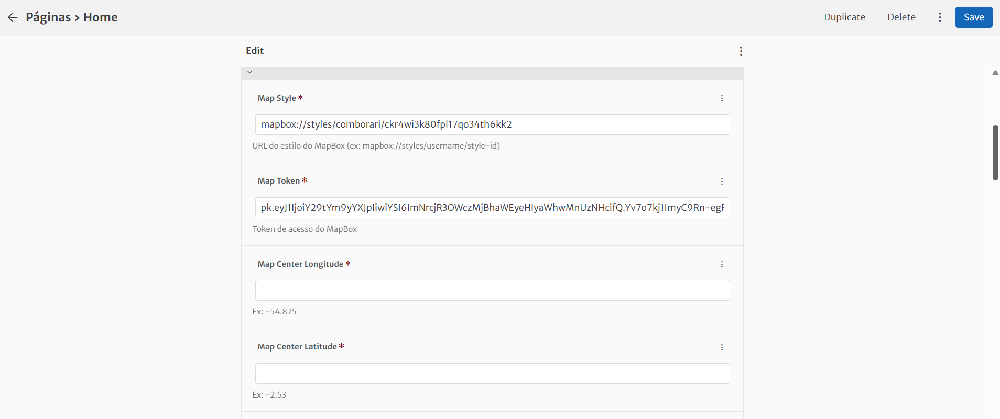[\[t\]](#cmnt20)[\[u\]](#cmnt21)

Campos de configuração do Mapbox na Documental.

### A vista inicial

### Em seguida, defina a visualização inicial, o "ponto de partida" do mapa. Os parâmetros são os mesmos de todas as vistas que você criar depois:

###  

<table>
<colgroup>
<col style="width: 50%" />
<col style="width: 50%" />
</colgroup>
<tbody>
<tr class="odd">
<td><h3 id="parâmetro" class="c57 c104">Parâmetro</h3></td>
<td><h3 id="o-que-define" class="c57 c104">O que define</h3></td>
</tr>
<tr class="even">
<td><h3 id="latitude-e-longitude" class="c10">Latitude e longitude</h3></td>
<td><h3 id="a-localização-do-ponto-central-do-mapa" class="c10">A localização do ponto central do mapa</h3></td>
</tr>
<tr class="odd">
<td><h3 id="zoom" class="c10">Zoom</h3></td>
<td><h3 id="o-nível-de-aproximação" class="c10">O nível de aproximação</h3></td>
</tr>
<tr class="even">
<td><h3 id="layers" class="c10">Layers</h3></td>
<td><h3 id="quais-camadas-do-mapbox-ficam-visíveis-nessa-vista.-é-possível-filtrar-para-que-apenas-determinadas-feições-apareçam-ver-seção-4.9.-recursos-complementares" class="c10">Quais camadas do Mapbox ficam visíveis nessa vista. É possível filtrar para que apenas determinadas feições apareçam (ver seção 4.9. Recursos Complementares)</h3></td>
</tr>
<tr class="odd">
<td><h3 id="duração-opcional" class="c10">Duração (opcional)</h3></td>
<td><h3 id="o-tempo-da-transição-entre-os-blocos-em-milissegundos" class="c10">O tempo da transição entre os blocos, em milissegundos</h3></td>
</tr>
<tr class="even">
<td><h3 id="bearing-opcional" class="c10">Bearing (opcional)</h3></td>
<td><h3 id="a-rotação-da-câmera-na-horizontal" class="c10">A rotação da câmera na horizontal</h3></td>
</tr>
<tr class="odd">
<td><h3 id="pitch-opcional" class="c10">Pitch (opcional)</h3></td>
<td><h3 id="a-rotação-da-câmera-na-vertical" class="c10">A rotação da câmera na vertical</h3></td>
</tr>
</tbody>
</table>

###  

### Os três parâmetros opcionais não afetam o funcionamento do mapa – servem para refinar o movimento e dar sensação de tridimensionalidade. Sobre o bearing e o pitch, consulte o[ glossário do Mapbox](https://www.google.com/url?q=https://docs.mapbox.com/help/glossary/bearing/&sa=D&source=editors&ust=1786675075445397&usg=AOvVaw1ZFj-mxEYvjlZnGZtW8rtb).

### 

|                                                                                                                                                                                                                                                                                                  |
| ------------------------------------------------------------------------------------------------------------------------------------------------------------------------------------------------------------------------------------------------------------------------------------------------ |
| De onde vêm os números: latitude, longitude e zoom saem da barra cinza inferior do Mapbox Studio (seção 3.4). Enquadre o mapa como deseja lá e anote os valores que aparecem. |

 

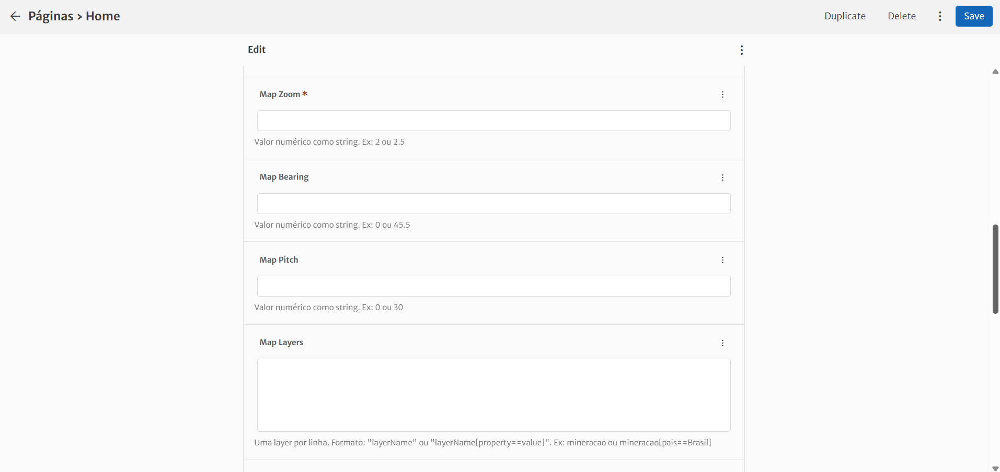

Configuração da vista inicial do
mapa.[\[v\]](#cmnt22)[\[w\]](#cmnt23)

### 

### Vistas do mapa

Depois de configurar a primeira vista, você verá o
campo para adicionar as demais vistas que irão compor a página. Cada
vista tem um identificador (ID)
único, que não deve
ser repetido em outra vista e não deve conter espaços nem caracteres
especiais (por exemplo, “vista\_secao\_1” está correto,
“vista seção 1\!@” está incorreto e pode dar erro na
página).

Preencha a localização do mapa (longitude e latitude).
O campo do zoom é apropriado para o funcionamento do mapa em notebooks e
outros desktops, mas é recomendado
verificar um zoom apropriado para mobile e tablet
também. A melhor
forma para definir consiste em abrir o mapa em um dispositivo
mobile/tablet e ir ajustando o zoom e outros parâmetros até que o mapa
esteja com a visualização
adequada. Em seguida,
ajuste duração, bearing, pitch e as
layers, todos os parâmetros voltados para essa
vista específica.

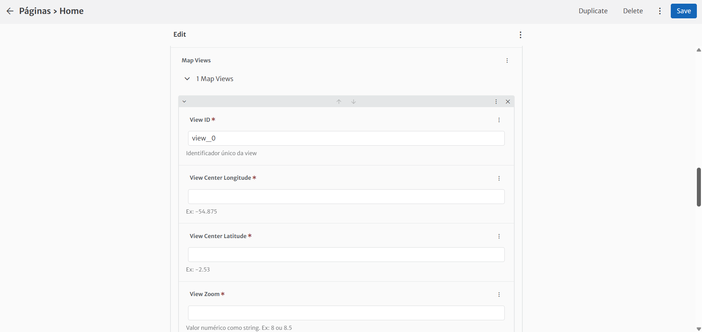

Adição de novas vistas do mapa.

Existe também um campo para definir a legenda de cada
vista do mapa. Nele você define
rótulos explicativos para os dados, podendo incluir um título e uma
descrição, se quiser. Ao abrir a aba de
configuração de legenda,
escreva o texto que será exibido na
legenda, se quiser,
defina um ícone personalizado para
a legenda via Google
Icons (ver
seção 4.9 Recursos
Complementares) e
selecione sua cor.

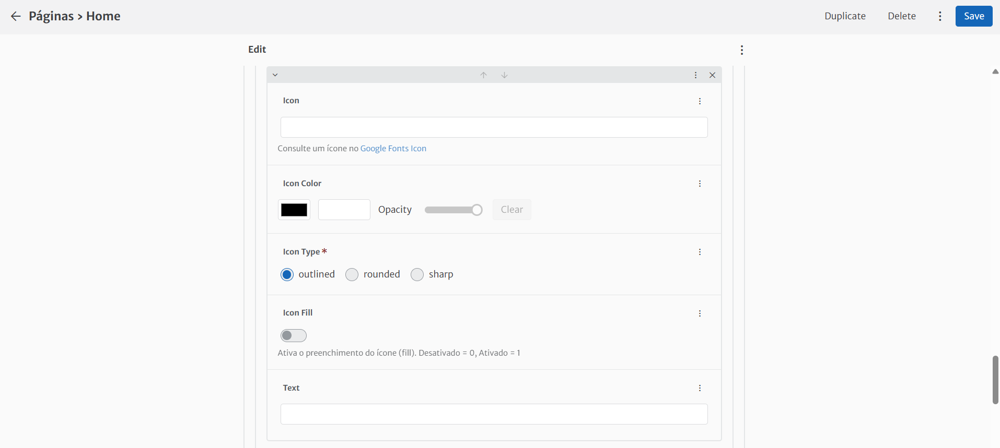

Configuração da legenda de uma vista.

## 4.7 Components \[Componentes\]

É através da seção
Componentes que o
conteúdo da página é montado.
Cada trecho de texto, cada imagem,
cada gráfico e cada movimento do mapa é um
componente, ou
bloco de
conteúdo. A plataforma reúne
28 blocos
diferentes, e é da combinação deles que nasce a
sua história: você escolhe quais usar e em que ordem, conforme o que
precisa mostrar e o tipo de narrativa que quer construir.

Os blocos seguem uma hierarquia, dividida em dois
tipos: blocos-raíz e
blocos-filho. Os
blocos-raíz funcionam como ponto de entrada, é a partir deles que os
blocos-filho podem ser chamados e inseridos no conteúdo da
página.

<table>
<colgroup>
<col style="width: 100%" />
</colgroup>
<tbody>
<tr class="odd">
<td>
O que são os blocos

Componentes, ou blocos, são estruturas prontas para receber conteúdo. Cada uma já vem com a diagramação, o comportamento e a adaptação a diferentes tamanhos de tela programados de antemão. Você não precisa desenhar e diagramar como as coisas aparecem: escolhe o bloco adequado e preenche os campos que ele pede, e ele já monta o conteúdo no design escolhido.

Cada tipo de bloco espera um tipo de material. O bloco Texto pede um texto; o Comparativo de Imagens pede duas imagens do mesmo lugar; a Linha do Tempo pede uma sequência de datas; o Gráfico de Barras pede números e rótulos.

Por isso, a escolha do bloco é, na prática, uma decisão narrativa: você não está escolhendo somente um formato visual, está escolhendo a forma de mostrar aquele conteúdo específico.
</td>
</tr>
</tbody>
</table>

 

### Os quatro blocos-raíz (root blocks)

Em Adicionar componentes,
quatro tipos de blocos-raíz, que
devem ser primeiramente implementados, estão disponíveis. Cada um atende
a um objetivo específico:

#### Group

O bloco-raíz do tipo Group,
é um tipo genérico utilizado para chamar os blocos que efetivamente
irão aparecer na página. Através dele, você também consegue
personalizar a paleta de cores definida em Page
Theme para o background e para o texto. Esse grupo também
acaba sendo utilizado para separar capítulos de conteúdo na sua
geohistória – existe uma opção para definir se esse grupo irá
configurar como um capítulo na
geohistória ou não, se sim, o
título do grupo aparecerá no menu- hambúrguer da sua
geohistória.

#### Map

O bloco-raíz Map, é
utilizado sempre que você quiser inserir um mapa na sua geohistória. É
por meio dele que são adicionadas as Mapviews. Também é possível inserir
imagens, vídeos embed e timeline dentro do scrolltelling dos mapas,
então, esses componentes – Text, Image, Video Embed e
Timeline explicados na seção 4.8.
Biblioteca de blocos – também ficam
disponíveis para manipulação dentro do bloco-raíz Map.

Call to Action

O Call to Action não tem a
funcionalidade de hospedar outros blocos dentro dele, e configura como
um bloco-raíz por aspectos técnicos. Ele constitui num grande bloco de
design, que tem a função de direcionar o visitante para uma ação
específica, como ver um cartaz e clicar num botão que irá direcioná-lo
para outra página. Ele cumpre a função literal de “Call to Action”, de
chamar atenção do visitante para um ação e realizar um direcionamento,
que poderia ser para a assinatura de uma petição, doação, leitura de um
documento, etc. 

#### Espaçador

O Espaçador insere um espaço
vazio entre dois blocos. O valor é informado em pixels. Serve para dar
respiro à página e para ajustar o ritmo da rolagem. É um espaçador do
tipo bloco-raíz, para ser aplicado entre outros
blocos-raíz, por exemplo, para dar um espaço
entre dois blocos
Group. 

#### Include

O bloco-raíz
Include é utilizado
para inserir uma sub-página dentro da geo-história, no ponto exato em
que ela deve aparecer. Antes de usá-lo, você precisa ter criado as
sub-páginas desejadas e atribuído a elas um Project em comum (que
agrupa na página de edição, todas as sub-páginas relacionadas).

Para usá-lo: no momento da geo-história em que a
sub-página deve aparecer, insira o componente Include e selecione a
sub-página que você quer referenciar. O conteúdo dela será chamado ali,
na sequência da narrativa. Depois de inserir um Include, você pode
seguir chamando outros componentes normalmente — inclusive um novo
Include, para trazer outra sub-página em outro ponto da história.

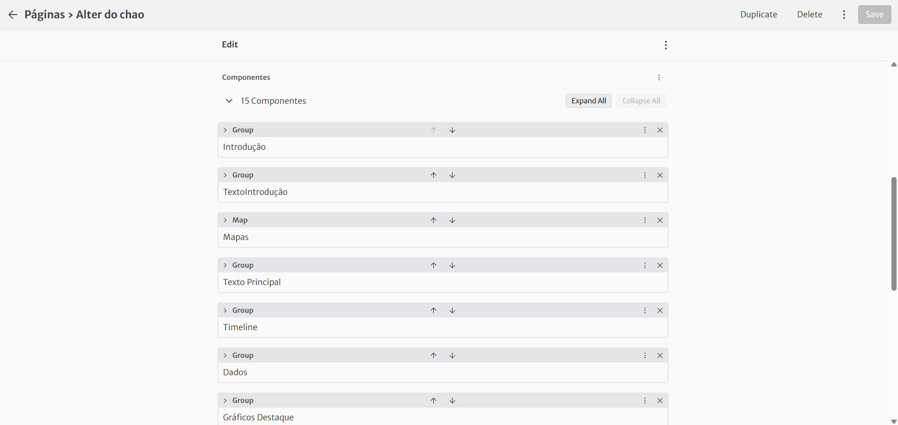[\[x\]](#cmnt24)

Seção Componentes, com os quatro
blocos-raíz.

Bloco principal

Função

Group

Permite a inserção dos blocos de design da Documental.
Pode funcionar como um capítulo da narrativa.
Permite definir cor de fundo, cor de texto personalizadas, e mídia de
fundo – é o bloco que dá unidade visual a um trecho da
história 

Map

Permite a inserção de mapas na
geohistória - é por
meio dele que são adicionadas as Mapviews. Também possui alguns outros
blocos de design disponíveis no seu catálogo (Image, Video Embed e
Timeline) que podem aparecer dentro dos
mapas.

Call to Action

Funciona como uma chamada para atenção. Direciona o
leitor a uma ação específica, como clicar em um botão ou acessar um link

Spacer

Adiciona espaçamento entre os elementos da
página

Na prática, uma página da Documental é uma sequência de blocos
Groups e
Maps, cada um com o seu conteúdo
dentro, intercalados aqui e ali por um Call to Action ou um
Spacer.

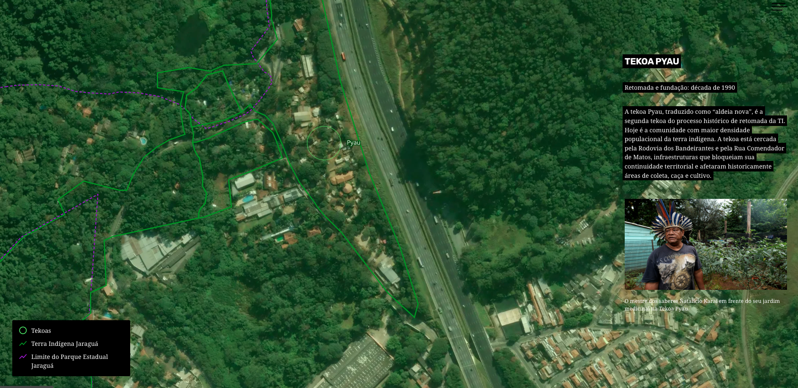

Exemplo de Bloco Map composto com blocos de texto
e imagem

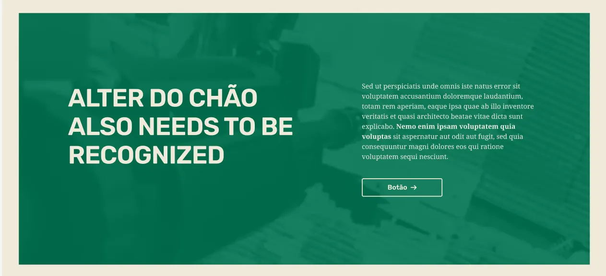[\[y\]](#cmnt25)[\[z\]](#cmnt26)

Exemplo de Bloco CTA (Call to Action).

### Identificação dos blocos

Cada bloco precisa ter um ID
único, sem espaços ou caracteres especiais, e
um Short Title, também
obrigatório. O Long Title é
opcional e, quando preenchido, é usado como rótulo do bloco no menu
lateral da página publicada. O campo
Description também é
opcional.

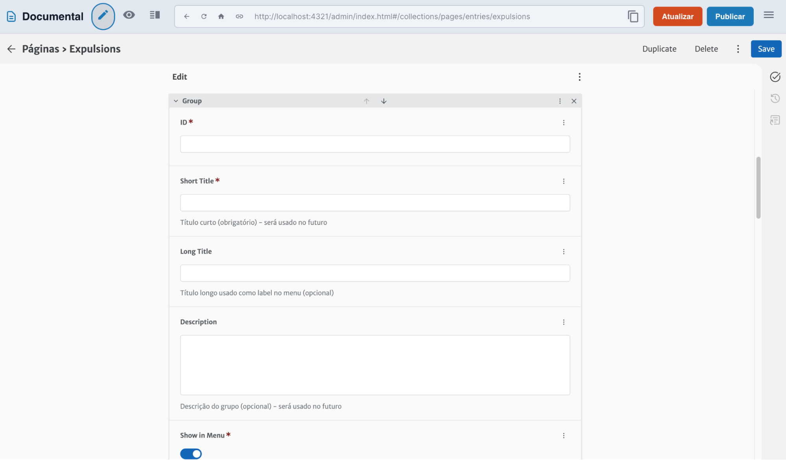

Campos de identificação de um bloco Group. Os
campos marcados com asterisco vermelho são obrigatórios, e cada um traz
abaixo uma nota explicando sua função.

### Configurações de fundo do Group

O bloco Group oferece, nas
configurações iniciais, a escolha da cor de fundo – entre as cores do
tema da página (Primary, Secondary, Highlight) ou uma cor personalizada,
com controle de opacidade. Também é possível adicionar uma
Background
media , que pode ser
um vídeo ou uma imagem armazenada no repositório de arquivos da
Documental, e aplicar sobre ela um
overlay claro ou escuro, para que
o texto por cima continue legível.

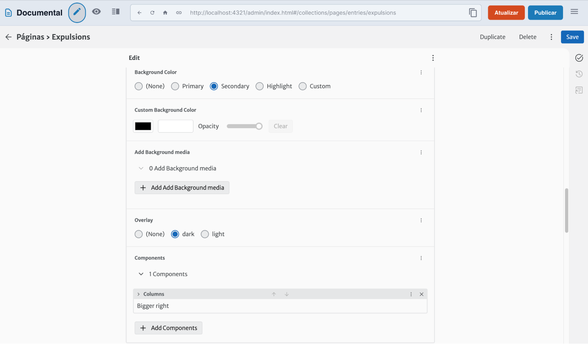

Configurações de fundo do bloco Group: cor de
fundo, mídia de fundo e camada de overlay. Ao final, o botão Add
Components é onde entram os blocos que formam o conteúdo.  

###  

### Montando a página

No final do conjunto
de blocos
Group e
Map, vemos o botão
Add Components, onde
conseguimos inserir outros blocos
para formar o conteúdo. Chamamos
eles de blocos-filhos. A composição das páginas da Documental
nasce da combinação de
blocos filhos dentro de
blocos-raíz. 

Nos dois exemplos abaixo, no primeiro grupo de blocos foi
utilizado o bloco Coluna Fixa, que
pode servir como capa da página. Dentro dele foram inseridas informações
de texto com o bloco Texto, e a
posição dos textos foi ajustada com os blocos
Espaçador. 

No segundo grupo, o conteúdo foi estruturado em formato de texto
corrido com o bloco Coluna, que
reúne dois blocos Texto e, no
final, um bloco
Citação para
destacar uma passagem.

A relação completa dos blocos-filhos, com descrição e exemplo de
cada um, está na seção 4.8 abaixo.

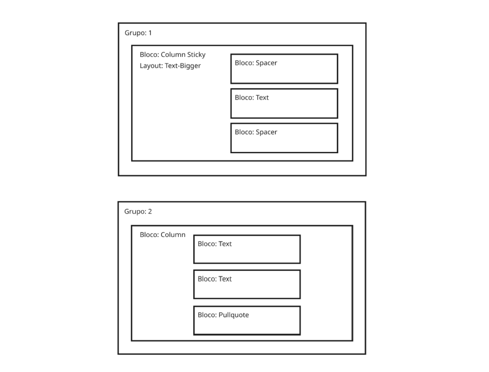

Dois exemplos de montagem de página.

  

## 4.8 Biblioteca de blocos-filhos

Esta seção apresenta a relação completa de todos os
blocos-filhos disponíveis e suas respectivas funções.

Montar uma página é, na prática, encaixar blocos-filhos
dentro dos blocos-raíz
Group e
Map, vistos na seção
anterior. A Documental possui blocos de
formatação de página, texto, imagem e vídeo, timeline, destaques
numéricos, interação e redirecionamento, além do bloco para viabilizar
a inserção de vistas do mapa. 

Entre os blocos-filhos há dois comportamentos. Alguns aceitam
outros blocos dentro de si: é o caso dos blocos de formatação, como o
Two Columns \[Duas Colunas\], que
divide o conteúdo em duas partes e recebe, em cada uma delas, blocos de
texto, imagem ou vídeo. Outros são simples e não aceitam composição – o
bloco Text \[Texto\],
por exemplo, carrega o seu próprio conteúdo e nada mais.

Assim, ao convocar o bloco-raíz
Group para montar um capítulo de
uma geohistória, você provavelmente vai
começar por um bloco-filho de formatação de página, e, dentro dele,
acrescentar blocos com funcionalidades mais específicas.

Abaixo, você encontra dois esquemas representativos da
relação entre blocos-raíz e tipos blocos-filhos, assim como suas
funcionalidades, que serão explicadas em mais detalhes a seguir.

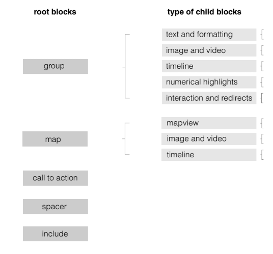

Esquema representativo da relação entre
blocos-raíz e os tipos de conteúdo possíveis a serem editados em cada
um a partir da inclusão de blocos-filhos.  

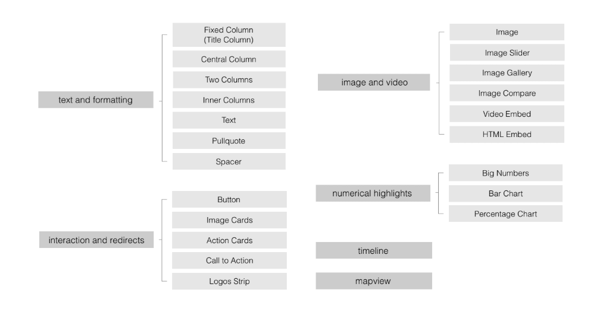

Blocos-filhos e suas funcionalidades

Abaixo, você encontra a relação de cada
bloco-filho, sua descrição e recomendações de aplicação. 

Se quiser visualizar os blocos aplicados, acesse a página de
exemplos dos layouts através do seguinte link:
[https://documental.xyz/exemplo/](https://www.google.com/url?q=https://documental.xyz/exemplo/&sa=D&source=editors&ust=1786675075500265&usg=AOvVaw1gr3cvc1A3hPByTSgIPd19)   

### → Formatação e texto  
  
Fixed Column / Title Column \[Coluna Fixa\]

Bloco de coluna fixa, geralmente usado como capa e título da
página: enquanto o leitor rola, o conteúdo permanece na tela. Traz um
campo próprio para o título e um botão para acrescentar outros blocos
que formam o corpo do texto. Há dois estilos de
composição, text-bigger e
title-bottom, que mudam a proporção entre título
e texto e a posição do título dentro do bloco. Também é possível ativar
um espaçamento padrão acima e abaixo.

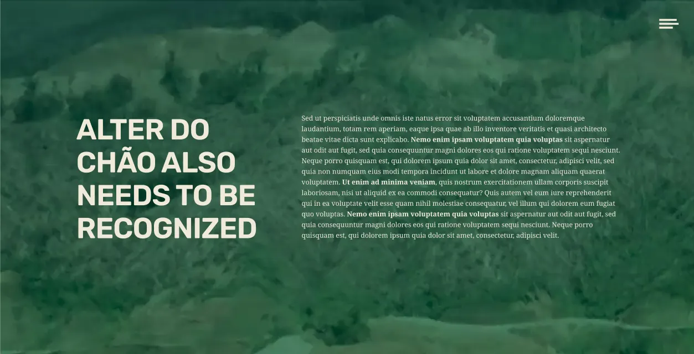Exemplo
de bloco Coluna Fixa usado como capa da página, com mídia de fundo e
overlay escuro.

#### Central Column \[Coluna Central\]

Organiza os blocos em uma única coluna, centralizada na
página e com largura limitada para facilitar a leitura. É o bloco de uso
mais corrente na Documental: serve para o texto corrido da narrativa e
para tudo o que o acompanha – imagens, vídeos, gráficos. Também é
possível ativar um espaçamento padrão acima e abaixo.

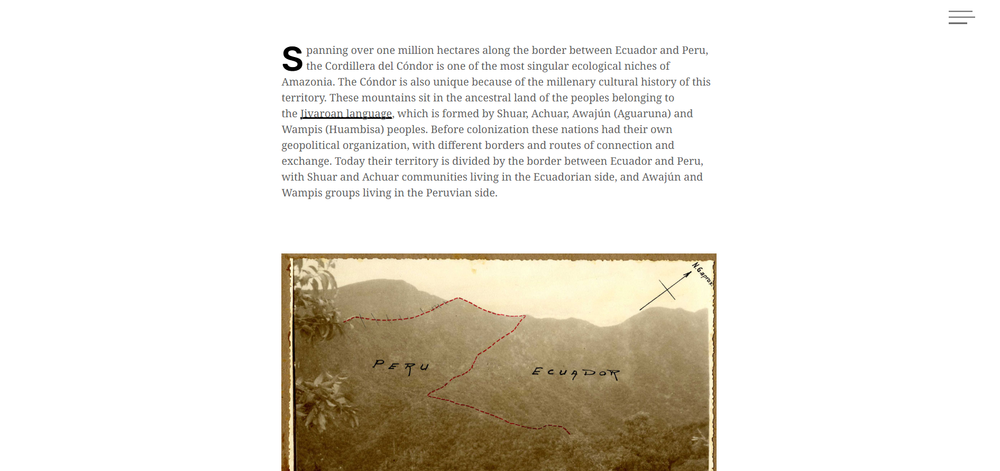  
Exemplo de bloco Coluna Centralizada, com
um bloco Texto e, abaixo, um bloco Imagem.

#### Two Columns \[Duas Colunas\]

Distribui os blocos em duas colunas lado a lado. Elas
não têm a mesma largura: você escolhe se a maior fica à esquerda ou à
direita, e a menor acompanha ao lado. É o bloco indicado para pôr dois
conteúdos em relação – um texto ao lado de uma linha do tempo, uma
imagem ao lado da sua explicação, um gráfico ao lado do parágrafo que o
interpreta. Também é possível ativar um espaçamento padrão acima e
abaixo.

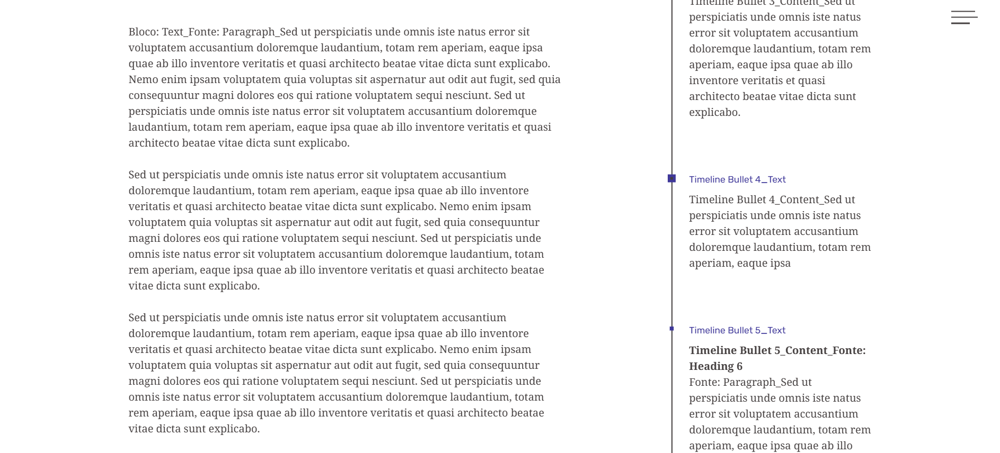

Exemplo de bloco Duas Colunas, com blocos de Texto
na coluna maior, à esquerda, e um bloco Linha do Tempo na coluna menor,
à direita.

#### 

#### Inner Columns \[Colunas Internas\]

#### Subdivide o conteúdo de uma coluna em duas colunas menores. Aceita somente blocos de texto, e serve para trechos em que dois parágrafos devem correr lado a lado, como um contraponto ou uma nota em paralelo ao texto principal.

#### 

#### Exemplo de bloco Colunas Internas, com dois blocos de texto lado a lado.

#### 

#### Text \[Texto\]

Bloco de texto corrido, com formatação básica: negrito, itálico,
links, títulos e listas. É o bloco mais usado da
plataforma.

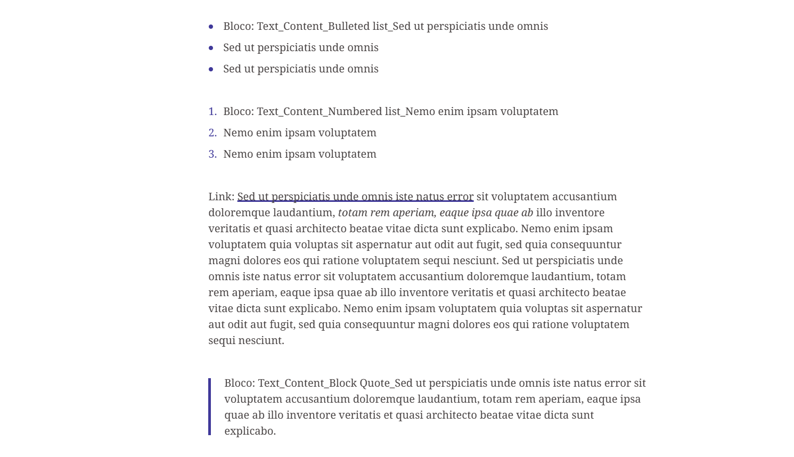

Exemplo de bloco Texto.

#### Pull Quote \[Citação\]

Exibe uma passagem em destaque, com tratamento
tipográfico diferente do texto corrido. Útil para depoimentos, trechos
de documentos e falas que devem interromper o fluxo da leitura.

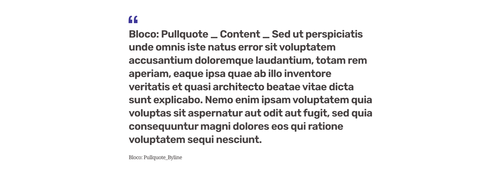

Exemplo de bloco Citação.

#### Espaçador

Insere um espaço vazio entre dois blocos. O valor é informado em
pixels. Serve para dar respiro à página e para ajustar o ritmo da
rolagem. Diferente do espaçador bloco-raíz, é um espaçador do tipo
bloco-filho, para ser aplicado entre outros
blocos-filho –  entre capas, em transições entre vistas de
mapa ou dentro de blocos de formatação, como
o Two Columns, para
trazer um dinamismo visual à página. 

### → Imagem e vídeo

#### Image \[Imagem\]

Exibe uma imagem armazenada no repositório de arquivos
da Documental, com campo para legenda.

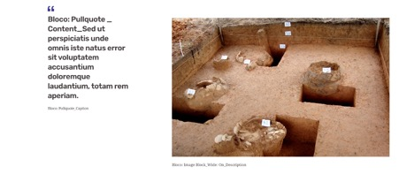

Exemplo de bloco Imagem, com legenda abaixo.

#### Video Embed  

Incorpora um vídeo hospedado em plataforma externa, como YouTube
ou Vimeo. O arquivo não fica no seu repositório: é carregado do serviço
de origem. Veja como obter o link
na seção 4.9 Recursos
Complementares.

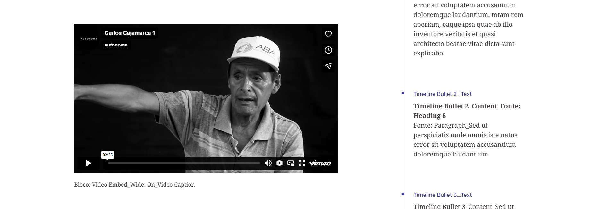

Bloco Vídeo Embed em composição com um bloco Text.
Ambos estão dentro do bloco Two Columns.

####   
HTML Embed

Permite inserir um trecho de código HTML na página, o
que possibilita incorporar conteúdo de outras plataformas – um gráfico
interativo, um formulário, um player de áudio. É o bloco a usar quando
nenhum outro dá conta.

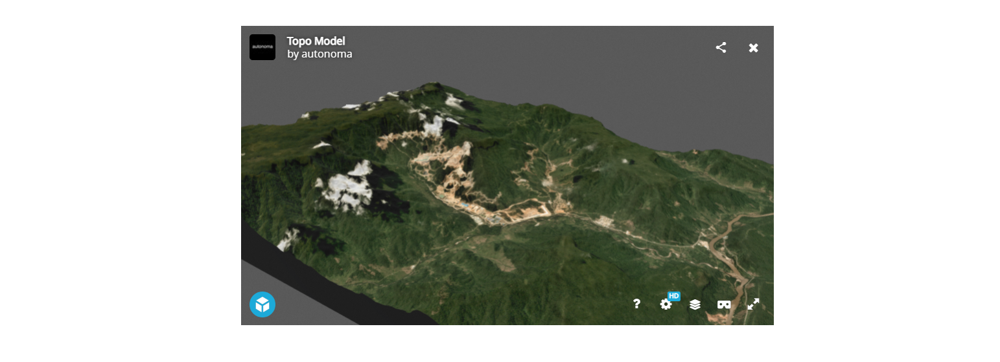[\[aa\]](#cmnt27)

Exemplo de bloco HTML Embed.

#### Image Slider \[Slider de Imagens\]

Exibe um conjunto de imagens em carrossel, uma de cada
vez, com navegação lateral. Indicado para sequências em que a ordem
importa.  

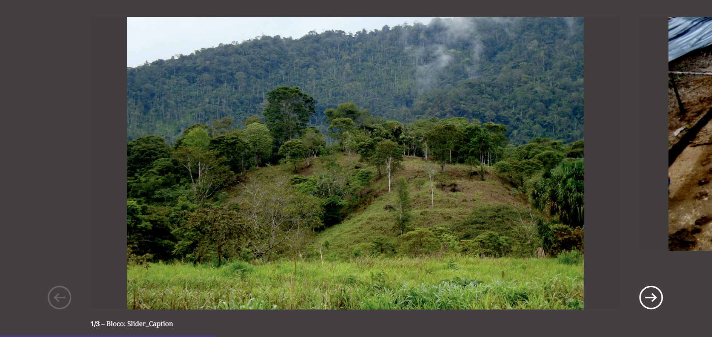

Exemplo de bloco Slider de Imagens.

#### Image Gallery \[Galeria de Imagens\]

Reúne um grupo de imagens em miniaturas. Ao ser
clicada, a imagem é ampliada. Indicado para conjuntos em que o leitor
escolhe o que quer ver de perto.

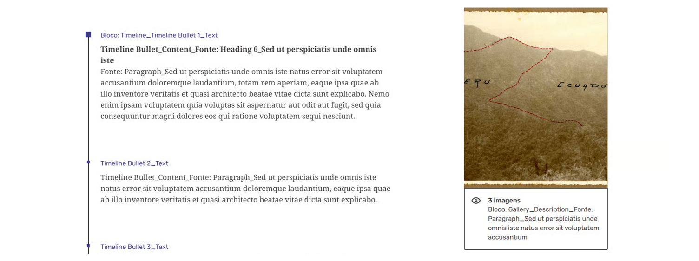

Exemplo de bloco Galeria, com as imagens em
miniatura.

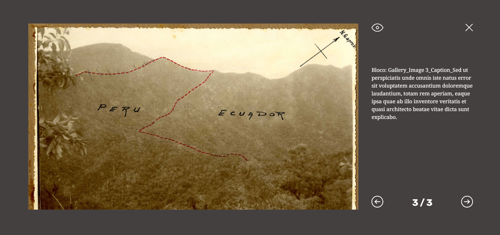

A mesma galeria com uma imagem ampliada, após o
clique.

#### Image Compare \[Comparativo de Imagens\]

Sobrepõe duas imagens do mesmo lugar com uma barra
deslizante, que o leitor arrasta para revelar uma ou outra. É o bloco
indicado para mostrar transformações no território – antes e depois de
um desmatamento, de uma obra, de um despejo.

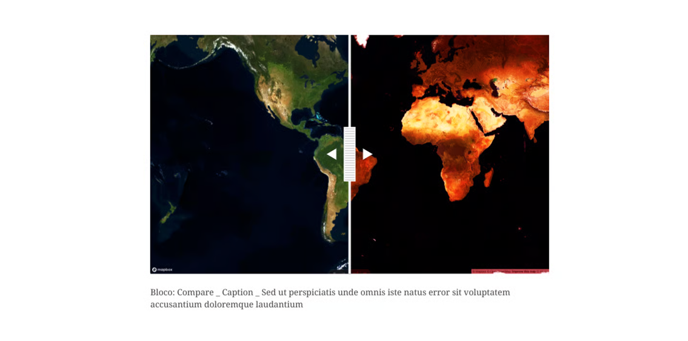

Exemplo de bloco Comparativo de Imagens.

### → Linha do tempo  
  
Timeline \[Linha do Tempo\]

Cria uma sequência cronológica de marcos ao longo de
uma linha. Além dos pontos, aceita blocos de imagem e vídeo embed, o que
permite ilustrar momentos específicos da cronologia.

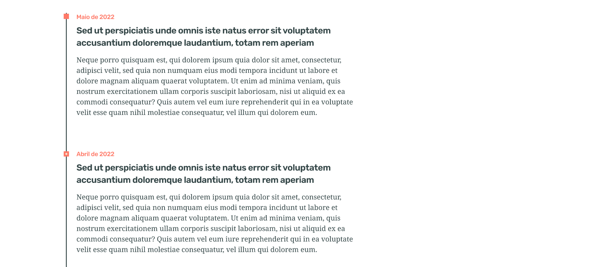[\[ab\]](#cmnt28)[\[ac\]](#cmnt29)

Exemplo de bloco Linha do Tempo.

#### Timeline Event Bullet \[Ponto da Linha do Tempo\]

Cada marco da cronologia, com data e descrição. Só pode
ser usado dentro de um bloco Linha do Tempo.

[\[ad\]](#cmnt30)

### → Mapa

#### Map \[Mapa\]

Insere um mapa na página e
organiza, dentro dele, os blocos
que acompanham a narrativa cartográfica. Além das vistas do mapa, aceita
blocos de texto, linha do tempo, imagem e vídeo, que rolam sobre o mapa
enquanto ele se move.

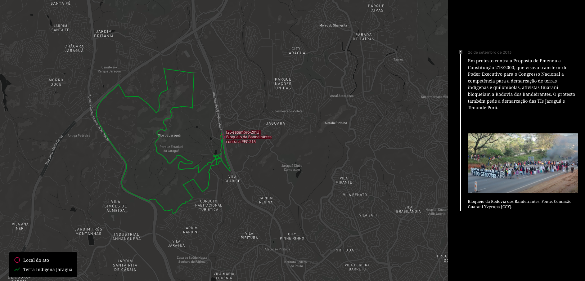

Exemplo de bloco Mapa composto com bloco Linha do
Tempo \[contexto Texto e Imagem\]  

Mapview \[Vista do Mapa\]

Indica uma mudança de enquadramento no mapa,
chamando uma das vistas já criadas nas
configurações do
Mapbox (seção
4.6 Modules). É o bloco que dispara o movimento
do mapa conforme o leitor rola a página.

###   
→ Destaques numéricos

####   
Bar Chart \[Gráfico de Barras\]

Exibe um conjunto de dados em barras, com rótulos e
valores. Indicado para comparar grandezas entre categorias.

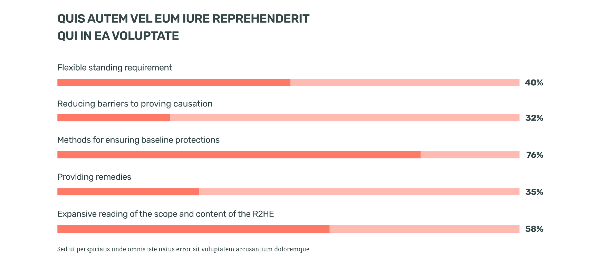

Exemplo de bloco Gráfico de Barras.

#### Percentage Chart \[Gráfico de Porcentagem\]

Mostra a divisão proporcional de um total, para
relações de parte e todo.

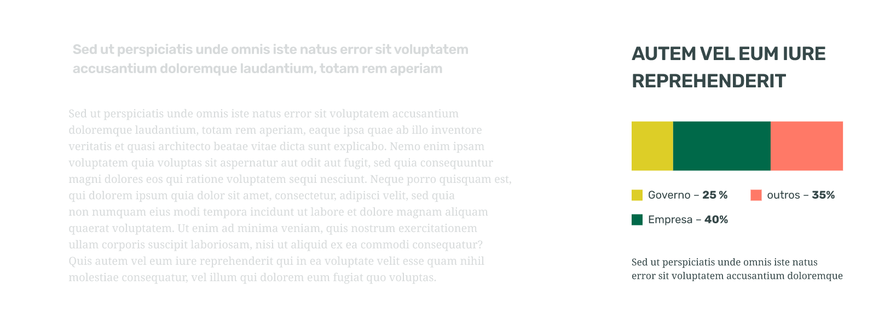

Exemplo de bloco Gráfico de Porcentagem.

#### Big Numbers \[Números Grandes\]

Destaca números isolados em corpo grande, acompanhados
de um rótulo. Útil para dar escala a uma informação: quantos hectares,
quantas famílias, quantos anos.

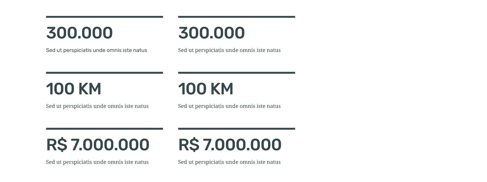

Exemplo de bloco Números Grandes.

### → Interação e créditos

#### Button \[Botão\]

Insere um botão que direciona para um link. Pode
receber um ícone e possui variações de alinhamento.

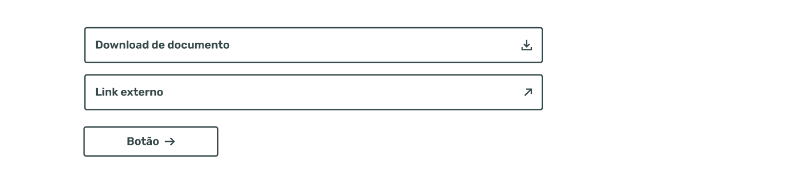

Exemplo de bloco Botão.

#### Action Cards \[Cartões de Ação\]

Cria um cartão de destaque, que pode levar a um link e
receber um ícone. Serve para chamar atenção a um conteúdo dentro do
fluxo da página.

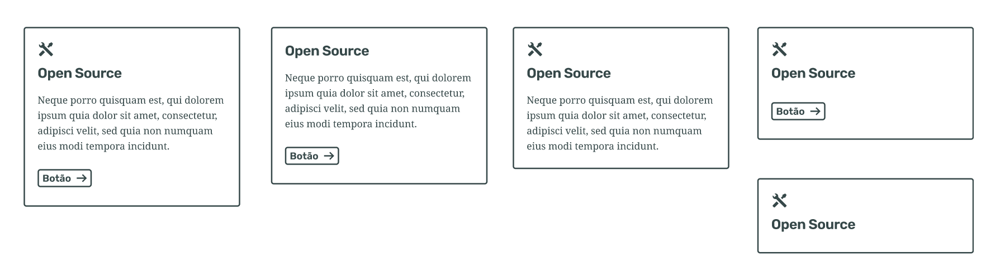

Exemplo de bloco Cartões.

#### Logos Strip \[Régua de Logos\]

Exibe uma fileira de imagens com links, normalmente
usada para creditar organizações parceiras e financiadoras ao pé da
página.

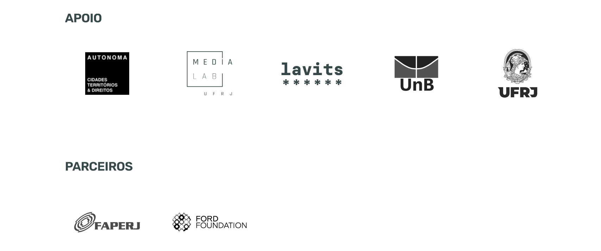

Exemplo de bloco Régua de Logos.

#### Image Cards \[Cartões de Imagem\]

Conjunto de cartões que remetem a outros conteúdos.
Usado com frequência ao final da página, como "veja também" ou chamada
para outras geohistórias.

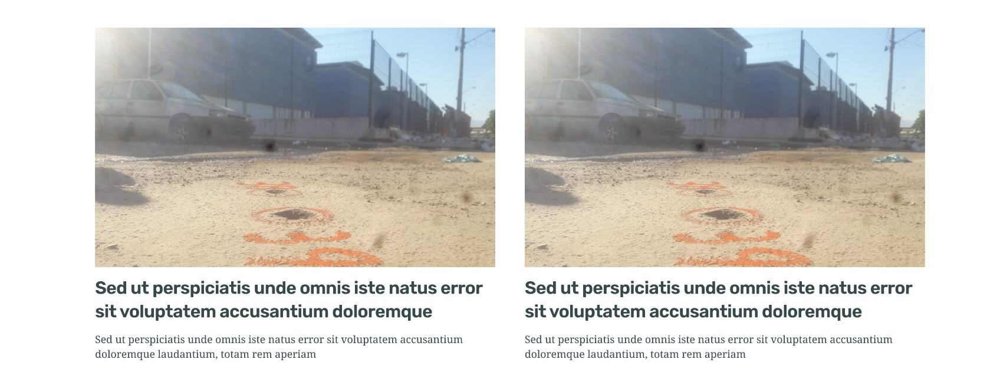

Exemplo de bloco Cartões de Chamada.

## 

## 4.9 Recursos complementares

### Filtros de layers

Na seção 4.6
Modules explicamos os parâmetros que compõem uma Mapview
(vista do mapa). Entre eles estão os
Layers – as camadas do
Mapbox que ficam visíveis naquela vista. Esta seção trata do mecanismo
de filtragem dessas camadas.

### Como listar as camadas

Para definir as camadas de uma vista, preencha o campo
View Layers com o nome de cada
uma, uma por linha.
Abaixo, o exemplo de uma vista montada a partir das camadas
listadas:

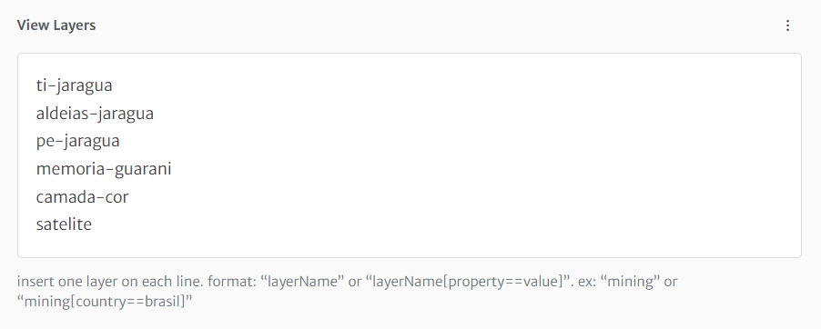

campo Layers preenchido com uma camada por
linha\] 

### Por que filtrar

Uma camada não corresponde necessariamente a um único
geodado: ela pode reunir vários. Dependendo da complexidade do mapa,
você vai querer exibir apenas um deles em determinada vista – e não a
camada inteira. É para isso que serve a filtragem: ela permite
evidenciar um geodado específico pelo seu atributo.

Se o geodado não tiver atributos, não há como
filtrá-lo. Os atributos precisam ser inseridos antes, em software de
GIS, na etapa de preparação dos dados.

<table>
<colgroup>
<col style="width: 100%" />
</colgroup>
<tbody>
<tr class="odd">
<td>
O que é um atributo

Atributo é cada informação associada a um elemento do geodado. Um ponto que marca uma manifestação pode carregar a data, o município, o número de participantes e a pauta; um polígono de desmatamento pode carregar o ano, a área em hectares e o bioma.

São esses campos, e os valores que guardam, que tornam a filtragem possível. Atributos são criados e editados em softwares como o QGIS, antes de os dados irem para o Mapbox. 
</td>
</tr>
</tbody>
</table>

### Como escrever o filtro

No exemplo abaixo, algumas camadas aparecem por inteiro
e duas recebem filtro:

 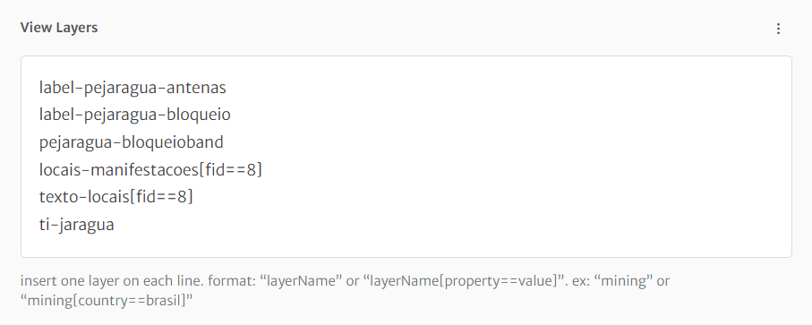

nomeDaLayer\[propriedade==valor\]

locais-manifestacoes\[fid==8\]

Escreva o nome da camada, abra colchetes, informe a propriedade do
atributo, o sinal
== e o valor
desejado.

### Quando você vai precisar disso

O Mapbox permite o upload de apenas 15 tilesets por estilo de mapa
(ver seção 3.1). Em
mapas mais robustos, isso obriga a agrupar vários geodados dentro de um
mesmo tileset – e a filtragem passa a ser a única forma de exibi-los
separadamente. É o que permite mostrar apenas os registros de um
determinado ano, município ou categoria sem precisar de um tileset para
cada recorte.

|                                                                                                                                                                                                                                                                                                                                                                                                                                   |
| --------------------------------------------------------------------------------------------------------------------------------------------------------------------------------------------------------------------------------------------------------------------------------------------------------------------------------------------------------------------------------------------------------------------------------- |
| Mapbox Standard não permite filtrar: como mencionado na seção 3.3, a filtragem de layers não funciona se o mapa estiver usando o Mapbox Standard como mapa base. Nesse estilo, as camadas vêm empacotadas pela Mapbox e não podem ser manipuladas individualmente – o que impede o filtro de operar. |

 

### Fontes personalizadas

Para inserir fontes personalizadas na Documental, entre
no site do [Google
Fonts](https://www.google.com/url?q=https://fonts.google.com/&sa=D&source=editors&ust=1786675075551713&usg=AOvVaw2Ah1fgDo-_J3aqVj8jUrbn) e
clique na fonte desejada, depois
clique em
Get font e em
Get embed
code.

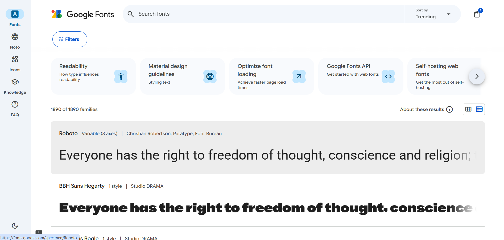

No Google Fonts, escolha a fonte desejada e clique em
Get font, depois em Get embed code.

Configure o estilo da fonte e copie a URL disponível em
Embed code in the \<head\> of your
html. Copie a URL que está entre aspas, dentro
de link href, conforme mostra
abaixo:

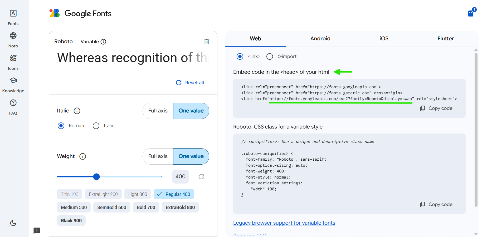

Copie apenas a URL que está entre aspas, dentro de
link href.

Insira essa URL no campo de
definição de fonte da Documental
[\[ae\]](#cmnt31)[\[af\]](#cmnt32)e
sua fonte personalizada estará configurada.

### 

### Ícones de legendas

Na seção 4.6 Modules, ao
tratar das vistas do mapa, mencionamos a possibilidade de inserir ícones
personalizados nas legendas. O ícone personalizado é definido pelo nome
do ícone no Google
Icons, que você informa no campo Icon, dentro da
configuração de legenda de cada vista.

Configuração da legenda de uma vista.

### Como encontrar o nome do ícone

1.    No site
do[ ](https://www.google.com/url?q=https://fonts.google.com/icons&sa=D&source=editors&ust=1786675075557721&usg=AOvVaw2BIY1WFL3ebQN9h14CXnRm)[Google
Icons](https://www.google.com/url?q=https://fonts.google.com/icons&sa=D&source=editors&ust=1786675075557986&usg=AOvVaw0joyOKWThUOdMK1GFuopRp),
clique no ícone desejado.

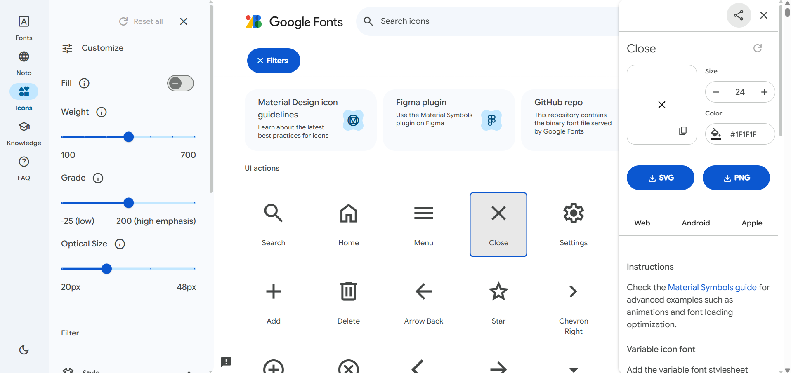

Biblioteca do Google Icons.

1.    Role a aba lateral que
se abre até encontrar o campo Icon
name.

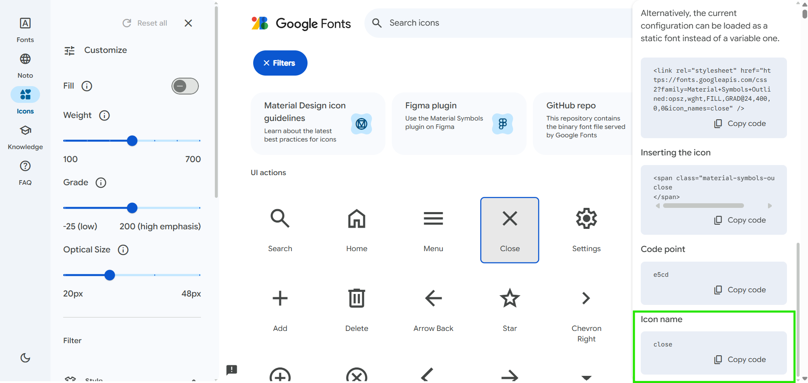

O campo Icon name, na aba lateral do ícone
selecionado.

1.    Copie esse nome e cole
no campo Icon, na
configuração de legenda da Documental.  

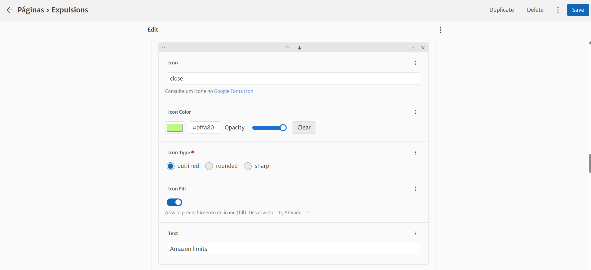

O nome do ícone colado no campo Icon.

 

|                                                                                                                                                                                                                                                                            |
| -------------------------------------------------------------------------------------------------------------------------------------------------------------------------------------------------------------------------------------------------------------------------- |
| Copie o nome exatamente como aparece: os nomes do Google Icons usam letras minúsculas e sublinhados, como location\_on ou warning. Qualquer variação impede o ícone de carregar, e a legenda aparece sem ele. |

 

Ainda na configuração da legenda, é possível escolher a
cor do ícone e indicar se ele será exibido preenchido ou apenas
contornado.

### Incorporação de vídeos externos

Você consegue incorporar um vídeo externo na Documental
através do bloco Vídeo
Embed.

Primeiro, navegue
até a plataforma com o vídeo que você deseja incorporar (como YouTube ou
Vimeo) e clique em Compartilhar ›
Incorporar.

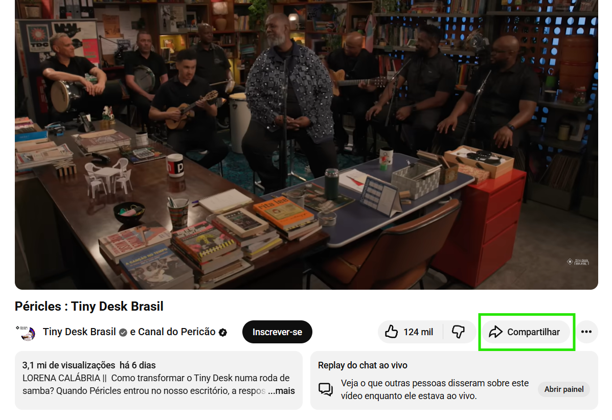

Na plataforma onde o vídeo está hospedado, clique em
Compartilhar.

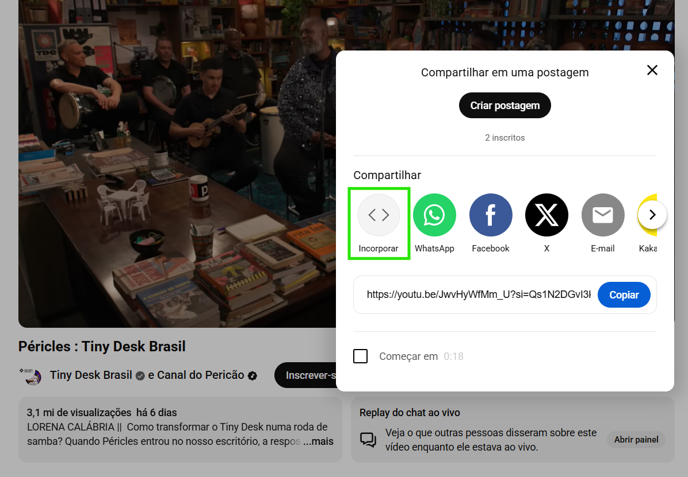

Em seguida, clique em Incorporar.

  
Ao clicar em
Incorporar, um
quadro irá se abrir. Copie o link da caixa de texto indicada abaixo
– note que ele possui "embed" no
meio da URL.

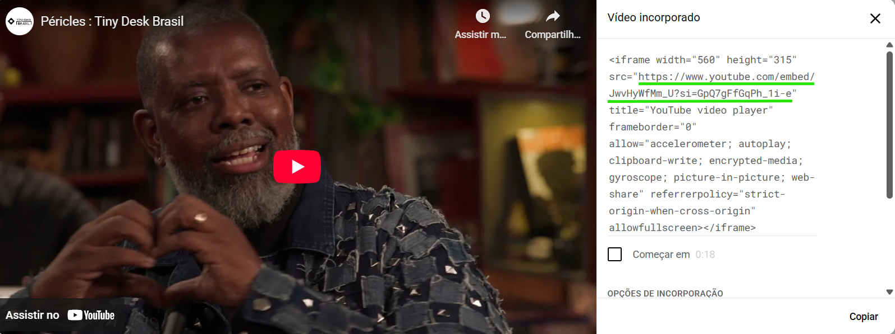

Copie o link indicado – note que ele traz "embed" no
meio da URL.

  
Depois cole o link
em Video URL, dentro
do bloco Vídeo
Embed, e seu vídeo será incorporado à
plataforma.

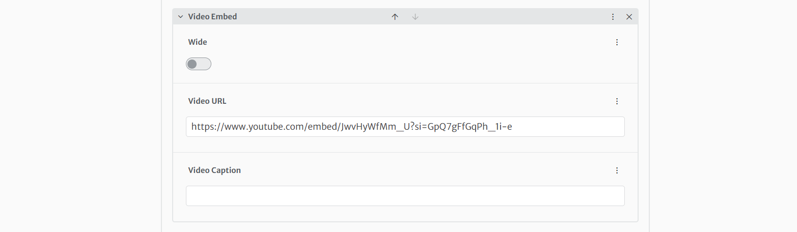

Cole o link no campo Video URL, dentro do bloco Vídeo
Embed.

-----

# 5. Publicando uma história

A plataforma da Documental foi montada pensando em que
os usuários conseguissem, de forma fácil e gratuita, publicar suas
páginas através do GitHub
Pages. Mas, se você for um usuário avançado,
também pode hospedar a página num servidor privado.

Ao terminar de editar sua geohistória, clique em "publicar", no
canto direito superior da tela para salvar e sincronizar o conteúdo no
seu repositório GitHub. Se você deixou o GitHub Pages ativado, sua
história será publicada automaticamente como
um site
acessível pelo seu repositório GitHub. Caso
não esteja ativado, siga abaixo os passos para publicar sua história
manualmente através do GitHub Pages. 

Feito isso, sua história está publicada em seu repositório\! O
formato do seu endereço URL ou domínio será algo como
\<seu\_usuário\>.[github.io/](https://www.google.com/url?q=http://github.io/&sa=D&source=editors&ust=1786675075571275&usg=AOvVaw2dWzIB0q9DJmGjAplDJ3IQ)\<seu\_repositório\>
, e você pode divulgar esse link para compartilhar seu projeto. 

Para ter um
domínio personalizado, é
necessário ter a assinatura de um plano pago do GitHub ou configurar
uma integração com um serviço de hospedagem próprio.  

Sempre que uma história é publicada pela Documental,
pedimos que seja mencionada a frase abaixo, como forma de apoiar o
desenvolvimento da plataforma:

powered by Documental.xyz

## 5.1 GitHub Pages

O [GitHub
Pages](https://www.google.com/url?q=https://docs.github.com/pt/pages/getting-started-with-github-pages/what-is-github-pages&sa=D&source=editors&ust=1786675075573200&usg=AOvVaw3RCw-35uGznhGyr07JloYq) é
um serviço de hospedagem de sites estáticos que utiliza os arquivos de
um repositório no GitHub (como HTML, CSS e JavaScript) para publicar um
site. É possível publicar um site vinculado ao nome de uma conta, de uma
organização, ou vinculado a uma subpasta de uma conta ou
organização.

Por padrão, o endereço do site reproduz o nome da
conta, da organização ou da subpasta escolhida, mas é possível
configurar um [domínio personalizado para o
site](https://www.google.com/url?q=https://docs.github.com/pt/pages/configuring-a-custom-domain-for-your-github-pages-site&sa=D&source=editors&ust=1786675075574632&usg=AOvVaw2ccYRR40sgdtX7KSfdDcFw).

|                                                                                                                                                                                                                                                                                                                                                                |
| -------------------------------------------------------------------------------------------------------------------------------------------------------------------------------------------------------------------------------------------------------------------------------------------------------------------------------------------------------------- |
| Talvez você já tenha feito isso: se você deixou a chave "Ativar GitHub Pages" ligada ao criar o ambiente de trabalho (seção 2.3) no aplicativo, a publicação já está configurada e você pode pular os passos abaixo. Eles servem para quem desligou a opção, ou para conferir se está tudo certo. |

 

Para publicar uma página através do GitHub Pages,
em sua conta do Github, vá até a
aba Repositórios e
clique no repositório com o site que você deseja publicar.

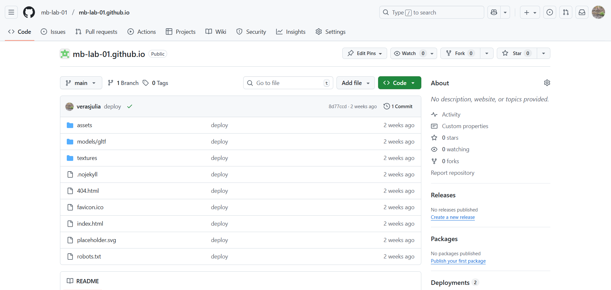

Na aba Repositórios da sua conta, clique no
repositório do site que você deseja publicar.

Clique em
Settings. No menu
lateral esquerdo, clique em
Pages.

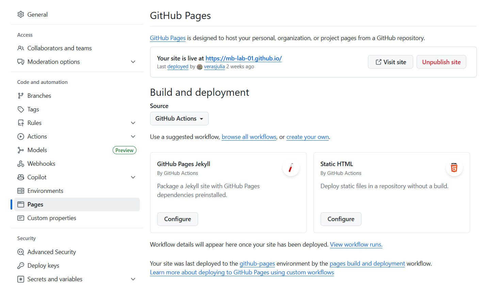

Em Settings, clique em Pages no menu lateral esquerdo.
Na seção Build and deployment, selecione GitHub Actions.

Na seção Build and
deployment, em
Source, selecione
GitHub Actions. A
página do GitHub vai atualizar e o link do seu site vai
aparecer.  

|                                                                                                                                                                                                                                             |
| ------------------------------------------------------------------------------------------------------------------------------------------------------------------------------------------------------------------------------------------- |
| A publicação leva alguns minutos: depois de configurado, o GitHub monta o site automaticamente a cada envio de alterações. Você pode acompanhar o andamento na aba Actions do repositório. |

## 5.2 Servidor próprio

Se você for um usuário avançado, pode usar o seu
próprio servidor para hospedar a Documental, seguindo os passos
deste [manual
técnico](https://www.google.com/url?q=https://github.com/thiagopaixao/astro_sveltia/blob/main/docs/DEPLOY-ACTIONS_pt-br.md&sa=D&source=editors&ust=1786675075581338&usg=AOvVaw24qzy7YdvqtEjrDqgJ_7G-).
Esse manual também possui informações avançadas sobre publicação através
do GitHub Pages.

Como o site gerado é estático, o servidor não precisa
de banco de dados nem de linguagem de programação rodando: basta um
servidor web comum servindo arquivos.

## 5.3 Site da Documental

Você também pode propor uma colaboração e
submeter a sua história para ser publicada no
site oficial da
[Documental](https://www.google.com/url?q=https://documental.xyz/&sa=D&source=editors&ust=1786675075583322&usg=AOvVaw2EHMo5HX5cs9e5KTQUcWJv).
Para entrar em contato, envie um e-mail para a
a[gência](https://www.google.com/url?q=https://www.advocacia.autonoma.xyz/&sa=D&source=editors&ust=1786675075583793&usg=AOvVaw2a0Nat80IHBvoePczkbnnw)
[a](https://www.google.com/url?q=https://www.advocacia.autonoma.xyz/&sa=D&source=editors&ust=1786675075583962&usg=AOvVaw0POwerbcW5ytNNQ7xYYxIE)[utônoma](https://www.google.com/url?q=https://www.advocacia.autonoma.xyz/&sa=D&source=editors&ust=1786675075584131&usg=AOvVaw1xlEvioizLSmGT1WZkPoyz) em
autonoma@autonoma.xyz.[\[ag\]](#cmnt33)

-----

# 6. Técnicas de scrollytelling

## 6.1 O que é scrollytelling?

Baseado nos termos
scroll (rolagem) e
storytelling (contação
de histórias), scrollytelling designa recursos utilizados em páginas web
onde a rolagem de tela controla a narrativa. Esta prática ganhou
destaque inicial em publicações online do chamado
long form
journalism, ou jornalismo de forma longa. Porém,
os mesmos esquemas narrativos e tecnologias também podem ser utilizados
de forma mais ampla.

A rolagem de tela é uma das formas mais intuitivas de
experiência do usuário durante a utilização de dispositivos eletrônicos,
sejam eles tablets, computadores desktop ou celulares. Mesmo pessoas
leigas ou crianças pequenas são capazes de reproduzir este gesto. Com o
scrollytelling, este ato simples pode controlar a aparição de textos,
fotos, vídeos ou a navegação por um mapa, como
implementa a Documental,
além de outras possibilidades, como a transição entre diferentes formas
de visualizar dados sobre um mesmo tema.

## 6.2 Métodos de scrollytelling

Em seu artigo
[Responsive scrollytelling best
practices](https://www.google.com/url?q=https://pudding.cool/process/responsive-scrollytelling/&sa=D&source=editors&ust=1786675075589178&usg=AOvVaw0_sFO7U_kxgZ56PpTdfd6O),
publicado no The Pudding, Russell Goldenberg destaca duas abordagens
principais para narrativas com scrollytelling. Uma delas é simplesmente
empilhar textos, imagens, cartografias ou gráficos diversos. A outra
consiste na rolagem de elementos sobre um fundo, em geral uma
visualização de dados ou um mapa. No artigo, Goldenberg cita ainda
outras abordagens possíveis, como usar o clique ou a função de deslizar,
mas não as recomenda.

A Documental é uma solução que permite trabalhar com
estas duas abordagens. É possível inclusive mesclar ambas, alternando
rolagem sobre um fundo (no caso, um mapa, representado pelo bloco
Mapa, e seções com textos ou
imagens fixas, empilhadas, como o
bloco Duas Colunas (ver seção 4.8
Biblioteca de blocos)

## 6.3 Textos e narrativas

Em artigo sobre design cartográfico como forma de
storytelling visual, Robert E. Roth recomenda que sejam selecionados
elementos para garantir uma linearidade durante a narrativa. Ele
menciona a estrutura em três atos como a abordagem mais tradicional e
também cita a tipologia proposta por Phillips
(2012), com oito arcos narrativos comumente
utilizados nas geociências e na geografia.

A narrativa clássica, em três atos, é baseada em três
etapas: set-up ou introdução, conflito e resolução. Ao longo deste
processo, são apresentados personagens (que podem ser pessoas, mas
também regiões geográficas, por exemplo), informações contextuais sobre
um problema e outras informações.

No início da narrativa, em geral, apresentam-se os
personagens, ambientes e o contexto do problema em questão. Para
scrollytelling baseado em mapas, é especialmente importante determinar
uma ou mais localidades (onde?) e temporalidades (quando?). Também se
recomenda a inserção de uma "isca" (teaser) para capturar a atenção da
pessoa leitora e gerar interesse na narrativa.

No segundo ato, o conflito, Roth enfatiza a criação
incremental de uma tensão e o desenvolvimento dos personagens, a fim de
gerar maior interesse da audiência. Ele sugere a criação de "pontos
narrativos", que podem ser pontos distintos em um mesmo mapa ou uma
sequência de mapas e gráficos, para construir pausas e ritmos dentro de
uma narrativa linear.

O pesquisador destaca os oito arcos narrativos
identificados por Phillips (2012) para narrativas baseadas em mapas.
Eles se dividem em dois grupos. Quatro destes arcos são baseados em um
único protagonista (um local ou região, onde o conflito surge de forças
internas ou externas): a destruição, a gênese, a emergência e a
metamorfose. Os outros quatro baseiam-se no conflito entre duas ou mais
forças ou personagens, que pode resultar em uma nova situação: causa e
efeito, convergência, divergência e oscilação.

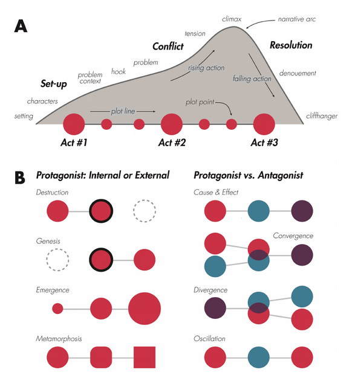

Reprodução da "Figura 1" do artigo Cartographic
Design as Visual Storytelling: Synthesis and Review of Map-Based
Narratives, Genres, and Tropes.

Por fim, na resolução
– o ato final da estrutura
narrativa em três etapas – chega-se
ao clímax. Esta conclusão pode se dar tanto com a convergência dos
personagens, problemas e ambientações criadas por uma determinada
solução, quanto deixando a cargo da audiência preencher as lacunas de
sentido com suas próprias experiências.

Como Roth destaca, muitos profissionais consideram este
esquema simplificado demais e adotam estruturas não lineares ou
paralelas para contar histórias. De todo modo, estes elementos e
estruturas básicas podem estimular novas práticas e abordagens para
contar histórias com mapas.

## 6.4 Definição da camada base

A camada base serve como a principal camada de
localização espacial, a partir da qual serão posicionadas outras
camadas de informações ou dados. Esta camada base pode ser uma imagem de
satélite ou marcações vetoriais.

No primeiro caso, temos um efeito mais realista, que
visa transmitir a sensação de deslocamento em um espaço real. As imagens
de satélite como camada base também permitem que objetos e entidades
– prédios, marcas de desmatamento
ou cidades, por exemplo – apareçam
no mapa "tal como" são na realidade.

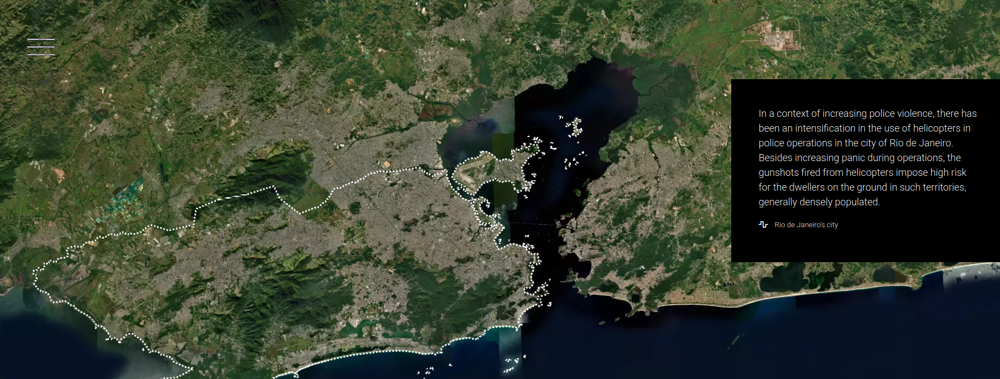

Base com imagem de satélite.

Por outro lado, um mapa base vetorial abstrai qualquer
informação visual desnecessária para representar apenas alguns
elementos. Deste modo, esta abordagem é muitas vezes utilizada para
visualizações de dados geográficos, uma vez que com a camada vetorial
podemos escolher o que será exibido (como fronteiras, nomes de rua e
assim por diante).

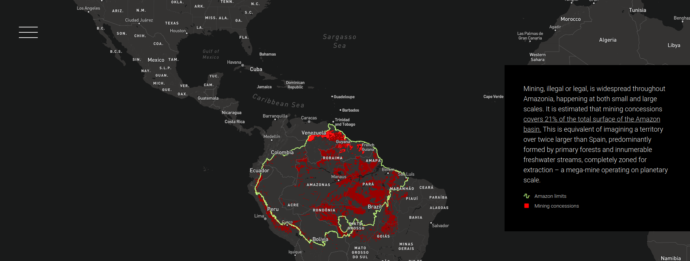

Base com camada vetorial.

## 6.5 Movimentos de câmera sobre mapas

### Aproximar ou afastar (zoom in/out)

O movimento de aproximar ou afastar a visão sobre o
mapa ajuda as narrativas a alternarem entre uma dimensão "macro" (uma
visão mais ampla para situar geograficamente o leitor, ou um mapa
coroplético, por exemplo) e
"micro" (pontos no mapa relacionados a fotos, ou uma subdivisão como os
municípios dentro de um estado).

O movimento de zoom in pode ser uma estratégia para
abordar algo mais específico depois de tratar questões mais gerais
(dedução), enquanto o contrário, zoom out, permite generalizar
(indução) ou contrapor uma experiência específica com uma visão mais
ampla. Este efeito é obtido criando dois blocos
Map em que o
sucessor tem um valor de zoom diferente do anterior.

### Panorâmica (panning)

Este movimento permite "passear" por um mapa. É útil
para detalhar trajetórias ou tratar de uma sequência de acontecimentos e
localizações relevantes para a narrativa. Pode ser alcançado usando
diferentes coordenadas geográficas para latitude e longitude em
diferentes blocos
Map.

### Bearing e pitch

O Mapbox oferece opções de
controle de câmera (ver
seção 4. Criando
uma história) que permitem também
ajustar a rotação e a posição do observador em relação ao mapa. Este
recurso dá a impressão de uma navegação em três dimensões e é útil para
reproduzir uma determinada perspectiva no mapa
– a de uma fotografia, por
exemplo.

### Sobreposição de imagens

A Documental também dá suporte a comparações de imagens
no estilo antes/depois. Este recurso é útil especialmente para mostrar
transformações temporais em um dado território, permitindo ao visitante
comparar facilmente duas imagens. Neste caso, os mapas devem ser salvos
como imagens e enviados usando o bloco
Comparativo de Imagens
(ver
seção
4.8 Biblioteca de
Blocos).

## 6.6 Outras plataformas e bibliotecas

Até o momento, não existem muitas opções gratuitas de
plataformas que forneçam uma interface gráfica para a construção de
narrativas com scrollytelling. A alternativa mais conhecida é o
[Flourish.Studio](https://www.google.com/url?q=https://help.flourish.studio/article/21-controlling-stories-with-scrollytelling&sa=D&source=editors&ust=1786675075613348&usg=AOvVaw1wHfAQkNgh9ytDeNTh-K1Y),
que já publicou um artigo específico sobre este
recurso. A Documental destaca-se por ser uma
solução de código aberto que, a partir do Sveltia e do Mapbox, fornece
uma interface gráfica para controle do scrollytelling e inclusão dos
conteúdos que formam a narrativa.

Existem, porém, diversas opções gratuitas ou de código
aberto disponíveis para implementar páginas com recursos de
scrollytelling "do zero". Em [artigo de janeiro
de 2017](https://www.google.com/url?q=https://pudding.cool/process/how-to-implement-scrollytelling/&sa=D&source=editors&ust=1786675075614767&usg=AOvVaw0mPoK_AmKp4sTqAxXVUsqi),
Russell Goldenberg elenca seis alternativas, junto com demonstrações de
seus códigos em funcionamento. As opções abaixo estão listadas de acordo
com a contribuição mais recente feita em seus respectivos
repositórios.

  - [JEO](https://www.google.com/url?q=https://github.com/InfoAmazonia/jeo-plugin&sa=D&source=editors&ust=1786675075615851&usg=AOvVaw3in4MNNXfotKa5snwatw0l):
    solução para WordPress criada pelo InfoAmazônia que permite inserir
    blocos de mapa interativos no editor Gutenberg.
  - [Scrollama](https://www.google.com/url?q=https://github.com/russellgoldenberg/scrollama&sa=D&source=editors&ust=1786675075616613&usg=AOvVaw3YQWoter0v8w3GQqqFssHI):
    biblioteca criada por Russell Goldenberg. Conta com uma
    [página com diferentes modelos
    prontos para
    uso](https://www.google.com/url?q=https://russellgoldenberg.github.io/scrollama/basic/&sa=D&source=editors&ust=1786675075617223&usg=AOvVaw2zpoolBXES1jheaDv4G-OR).
    É uma opção relativamente acessível, mesmo para quem tem apenas
    conhecimentos básicos de JavaScript. O
    [vídeo
    tutorial](https://www.google.com/url?q=https://www.youtube.com/watch?v%3Dd7wTA9F-l8c&sa=D&source=editors&ust=1786675075617813&usg=AOvVaw1TkaGFBPhKNvmd_-tedVEQ)[ de
    Jonathan
    Soma](https://www.google.com/url?q=https://www.youtube.com/watch?v%3Dd7wTA9F-l8c&sa=D&source=editors&ust=1786675075618065&usg=AOvVaw131v3wgPBjgBoaQqpawB7u) apresenta
    um bom passo a passo.
  - [ScrollMagic](https://www.google.com/url?q=http://scrollmagic.io/&sa=D&source=editors&ust=1786675075618475&usg=AOvVaw3Lk8-8iS0JrdmbwrwN_cy_):
    recomendada por Goldenberg para casos que exigem bastante
    personalização da interação.
  - [ScrollStory](https://www.google.com/url?q=http://sjwilliams.github.io/scrollstory/&sa=D&source=editors&ust=1786675075619057&usg=AOvVaw0DSX2lf9B0Pd1ywV9fvukD):
    plugin em jQuery utilizado em algumas histórias do The New York
    Times. Recomendado para iniciantes que utilizam jQuery.
  - [graph-scroll](https://www.google.com/url?q=https://1wheel.github.io/graph-scroll/&sa=D&source=editors&ust=1786675075619818&usg=AOvVaw0a8ov24jGVsJeIwTdT-g4u):
    plugin baseado na biblioteca D3 que fornece recursos simples para
    scrollytelling. Recomendável especialmente para visualizações de
    dados que também façam uso de D3.

O artigo de Goldenberg também cita duas bibliotecas há
mais tempo inativas: o
[Waypoints](https://www.google.com/url?q=http://imakewebthings.com/waypoints/&sa=D&source=editors&ust=1786675075620974&usg=AOvVaw2BQXIFed6rVnZURPAlkxbf),
cuja última atualização é de setembro de 2016, e o
[in-view.js](https://www.google.com/url?q=https://github.com/camwiegert/in-view&sa=D&source=editors&ust=1786675075621401&usg=AOvVaw1Us94P8nz5ZugyPV4a8cxl),
oficialmente inativo.

Além das alternativas acima, há a opção de utilizar o
[Svelte](https://www.google.com/url?q=https://svelte.dev/&sa=D&source=editors&ust=1786675075622006&usg=AOvVaw1bX0G_RszHHlAaQtpwl7e8).
Neste caso, vale conferir o [modelo
do](https://www.google.com/url?q=https://github.com/the-pudding/svelte-starter&sa=D&source=editors&ust=1786675075622386&usg=AOvVaw2EJdmKHJXyRdKPW3a4gzqu)
[The
Pudding](https://www.google.com/url?q=https://github.com/the-pudding/svelte-starter&sa=D&source=editors&ust=1786675075622614&usg=AOvVaw1CXqhNP9tDdxJOBP5C6eyq),
que conta com um componente específico para este tipo de visualização
interativa, e o [tutorial escrito por Connor
Rothschild](https://www.google.com/url?q=https://www.connorrothschild.com/post/svelte-scrollytelling&sa=D&source=editors&ust=1786675075623216&usg=AOvVaw3vFQPdB_Pc9T0ctxMHTIgs).

-----

# 7. Problemas comuns

Sintoma

Causa provável

Solução

O aplicativo não abre no macOS e diz que é de
"desenvolvedor não identificado"        

O aplicativo não tem assinatura digital paga e o
sistema bloqueia a primeira execução

Ajustes do Sistema › Privacidade e Segurança ›
Segurança › "Abrir mesmo assim"

O Windows bloqueia o instalador

O aplicativo não tem assinatura digital paga

Clique em "Mais informações" e depois em "Executar
assim mesmo"

O mapa aparece em branco

Access Token ou Map Style ausente, incorreto, ou falta
de internet

Confira os dois campos nas Configurações do Mapbox. O
token deve começar com pk.

Os filtros de layers não funcionam

O estilo de mapa usado é o Mapbox Standard ou você
aplicou os filtros das layers de forma errada.

Troque por um estilo criado do zero ou por um dos
modelos da Autônoma (seção
3.3)

A página apresenta erros ou comportamento
estranho

IDs, títulos ou links duplicados entre histórias ou
entre vistas

Verifique se todos os IDs de blocos e de vistas são
únicos, sem espaços ou caracteres especiais

O site não aparece depois de publicar

A publicação leva alguns minutos, ou o GitHub Pages
não foi configurado

Aguarde e confira Settings › Pages e a aba Actions do
repositório

A publicação falhou (marca vermelha na aba
Actions)

Erro na construção do site

Abra a execução na aba Actions e leia a mensagem de
erro

As imagens não aparecem no site publicado

Arquivos de mídia não foram enviados

Verifique se as imagens estão no repositório de
arquivos da Documental e foram incluídas no envio

O mapa fica lento, sobretudo no celular

Camadas demais ou dados geográficos muito
pesados

Reduza o número de camadas e simplifique a geometria
dos dados no QGIS antes de subir ao Mapbox

O zoom fica bom no computador mas ruim no
celular

O zoom foi ajustado apenas para desktop

Verifique e ajuste um zoom apropriado para mobile e
tablet em cada vista

-----

# 8. Como colaborar 

Para colaborar com o código da Documental, use o
repositório:
[github.com/Documental-XYZ/](https://www.google.com/url?q=http://github.com/Plataforma-Documental-XYZ/Documental-2.0&sa=D&source=editors&ust=1786675075642661&usg=AOvVaw3QNJ12dbI9mlts7EBAT8S0)[Core](https://www.google.com/url?q=http://github.com/Plataforma-Documental-XYZ/Documental-2.0&sa=D&source=editors&ust=1786675075642952&usg=AOvVaw1enGIxtHpbDaQhA031-FEm)

Para colaborar ou aperfeiçoar nossa documentação, use o
repositório:
[github.com/Documental-XYZ/](https://www.google.com/url?q=http://github.com/Plataforma-Documental-XYZ/Documental-2.0&sa=D&source=editors&ust=1786675075643631&usg=AOvVaw1DS__9Zq-VAboBomLQVx-3)[Docs](https://www.google.com/url?q=http://github.com/medialabufrj/documental_docs&sa=D&source=editors&ust=1786675075643837&usg=AOvVaw3GbR43HtMpSmOTeWiUmLPO)

Caso tenha uma sugestão de melhoria no código ou na
documentação, use a função de pull
request para enviar sua proposta. Caso queira
compartilhar novas sugestões ou comentários em geral sobre a plataforma,
você também pode abrir uma
issue.

## Como creditar o projeto

Solicitamos que projetos que façam uso da plataforma
incluam a seguinte menção, como forma de apoiar o desenvolvimento da
plataforma:

powered by Documental.xyz

# 9. Referências e recursos

  - [GitHub
    Docs](https://www.google.com/url?q=https://docs.github.com/pt&sa=D&source=editors&ust=1786675075646562&usg=AOvVaw3xhV4PT48CIGFU6LZu6k51) – documentação
    técnica do GitHub
  - [Mapbox
    Docs](https://www.google.com/url?q=https://docs.mapbox.com/&sa=D&source=editors&ust=1786675075647068&usg=AOvVaw0kyLH4g4oI0aZAmSy9J9u1) – documentação
    técnica do Mapbox
  - [Manual
    técnico](https://www.google.com/url?q=https://github.com/thiagopaixao/astro_sveltia/blob/main/docs/DEPLOY-ACTIONS_pt-br.md&sa=D&source=editors&ust=1786675075647544&usg=AOvVaw2n7kACwBN8P6Tz_xBq65rk) – hospedagem
    da Documental em servidor privado e no GitHub Pages
  - [Geodados: uma introdução
    gentil](https://www.google.com/url?q=https://gis.escoladedados.org&sa=D&source=editors&ust=1786675075648142&usg=AOvVaw37XJ7jw9Jnk66-Vv8SyTE6)
    — ebook da Escola de Dados sobre geodados e
    QGIS

Roth, Robert E. (2020). Cartographic Design as Visual
Storytelling: Synthesis and Review of Map-Based Narratives, Genres, and
Tropes. The Cartographic Journal. DOI:
10.1080/00087041.2019.1633103

Phillips, J. (2012). Storytelling in Earth Sciences:
The Eight Basic Plots. Earth-Science Reviews, 115(3), pp. 153–162. DOI:
10.1016/j.earscirev.2012.09.005

# 10. Equipe

## Agência Autônoma

  - Paulo Tavares
    – direção
  - Paula Marujo
    – coordenação
  - Julia Veras
    – implementação 

## MediaLab UFRJ

  - Fernanda Bruno
    – direção
  - Adriano Belisario –
    implementação e
    documentação[\[ah\]](#cmnt34)

## Desenvolvimento de software

Documental 2.0:

  - Thiago Paixão
    – back-end
  - Atonal –
    front-end

Documental 1.0:

  - [Marlus
    Araújo](https://www.google.com/url?q=https://github.com/sulram&sa=D&source=editors&ust=1786675075651475&usg=AOvVaw10EcfCuZ8RBlvLnLQHXtFO)
  - [Rafael
    Bantu](https://www.google.com/url?q=https://github.com/rafaelbantu&sa=D&source=editors&ust=1786675075651695&usg=AOvVaw30lSPubdCyf2UUBgYtImA6) – atualização
    e publicação do starter kit em código
    aberto[\[ai\]](#cmnt35)

## Apoio

  - Fundação Ford
  - Fundação Carlos Chagas Filho de Amparo à Pesquisa
    do Estado do Rio de Janeiro
    (FAPERJ)[\[aj\]](#cmnt36)

[documental.xyz](https://www.google.com/url?q=https://documental.xyz&sa=D&source=editors&ust=1786675075652808&usg=AOvVaw16NPczsdX4kzAzSbn012eI) 
 ·   agência
autônoma:
[advocacia.autonoma.xyz](https://www.google.com/url?q=https://www.advocacia.autonoma.xyz/&sa=D&source=editors&ust=1786675075653178&usg=AOvVaw0UBGZZm4QrP47ODlgLIP54) 
[@aautonoma](https://www.google.com/url?q=https://www.instagram.com/aautonoma/&sa=D&source=editors&ust=1786675075653449&usg=AOvVaw0FTTXIQm1ir_MgA5XYp1mK) ·
 MediaLab UFRJ:
[medialabufrj.net](https://www.google.com/url?q=https://medialabufrj.net&sa=D&source=editors&ust=1786675075653885&usg=AOvVaw0Xi9hQQX9Pr530xI6OSPIA) 
[@medialabufrj](https://www.google.com/url?q=https://www.instagram.com/medialabufrj/&sa=D&source=editors&ust=1786675075654164&usg=AOvVaw2FmCQY5nhwlF-wh9aOghfl)

Documental — Guia de instalação e uso   ·  

[\[a\]](#cmnt_ref1)definir um email

[\[b\]](#cmnt_ref2)documental@autonoma.xyz
?

[\[c\]](#cmnt_ref3)substituir imagem

[\[d\]](#cmnt_ref4)@thiago.apaixao@gmail.com

[\[e\]](#cmnt_ref5)incluir prints

[\[f\]](#cmnt_ref6)@thiago.apaixao@gmail.com

[\[g\]](#cmnt_ref7)substituir para página nova
em que está "criar novo ambiente de trabalho"
@thiago.apaixao@gmail.com

\_Atribuído a thiago.apaixao@gmail.com\_

[\[h\]](#cmnt_ref8)trocar, não vai mais ter
fork

[\[i\]](#cmnt_ref9)@thiago.apaixao@gmail.com

[\[j\]](#cmnt_ref10)atualizar print

[\[k\]](#cmnt_ref11)@thiago.apaixao@gmail.com

[\[l\]](#cmnt_ref12)inserir print página boas
vindas @thiago.apaixao@gmail.com

\_Atribuído a thiago.apaixao@gmail.com\_

[\[m\]](#cmnt_ref13)inserir os prints ref. a
cada modo de visualização:  ambiente de trabalho, sveltia, tela
dividida

[\[n\]](#cmnt_ref14)@thiago.apaixao@gmail.com

[\[o\]](#cmnt_ref15)incluir esse print do
app

[\[p\]](#cmnt_ref16)@thiago.apaixao@gmail.com

[\[q\]](#cmnt_ref17)print

[\[r\]](#cmnt_ref18)@thiago.apaixao@gmail.com

[\[s\]](#cmnt_ref19)inserir print
@thiago.apaixao@gmail.com

\_Atribuído a thiago.apaixao@gmail.com\_

[\[t\]](#cmnt_ref20)lat e long já aparecem
aqui

[\[u\]](#cmnt_ref21)não entendi

[\[v\]](#cmnt_ref22)é esse o print certo? nao
precisa ter a lat long?

[\[w\]](#cmnt_ref23)@thiago.apaixao@gmail.com

[\[x\]](#cmnt_ref24)substituir com page include
@thiago.apaixao@gmail.com

\_Atribuído a thiago.apaixao@gmail.com\_

[\[y\]](#cmnt_ref25)usar exemplos concretos -
landing page?

[\[z\]](#cmnt_ref26)@thiago.apaixao@gmail.com

[\[aa\]](#cmnt_ref27)não da pra entender muito
bem esse exemplo

[\[ab\]](#cmnt_ref28)seria bom um exemplo com
fotos

[\[ac\]](#cmnt_ref29)@jcgveras@gmail.com
@thiago.apaixao@gmail.com

[\[ad\]](#cmnt_ref30)imagem de exemplo?
@jcgveras@gmail.com @thiago.apaixao@gmail.com

[\[ae\]](#cmnt_ref31)inserir captura de
tela

[\[af\]](#cmnt_ref32)@thiago.apaixao@gmail.com

[\[ag\]](#cmnt_ref33)deixamos assim?

[\[ah\]](#cmnt_ref34)como creditar?

[\[ai\]](#cmnt_ref35)fizeram a 1.0, como
creditar?

[\[aj\]](#cmnt_ref36)mantém?

