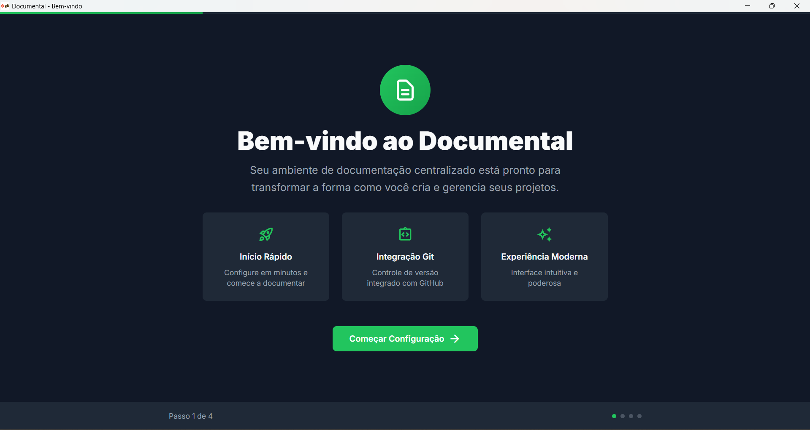

# \_Primeiro acesso

A Documental.xyz é baseada em uma filosofia de código aberto: seu funcionamento parte da clonagem dos arquivos principais do projeto para o seu repositório pessoal no [GitHub](https://github.com/), e a partir dessa cópia, é possível modificar o conteúdo e a estrutura das páginas adaptando às necessidades de cada narrativa.&#x20;

O GitHub consiste numa plataforma online que permite [armazenar, versionar e publicar softwares de forma colaborativa](https://docs.github.com/pt/get-started/start-your-journey/about-github-and-git). Ao carregar arquivos no Github, você os armazena num repositório Git, que tem suas alterações monitoradas pela plataforma. No contexto da Documental, você realiza o upload das histórias através do aplicativo e é ele quem cuida do versionamento dos arquivos no Github. Por fim, existem três caminhos para publicar uma história da Documental, através do GitHub Pages, através de um servidor pessoal, ou no servidor da agência autônoma, você pode ver mais sobre essas informações na aba [Publicando uma história](/broken/pages/upMTygzbVxWDGq1TM5B0).&#x20;

### Crie um repositório no Github

Para conseguir utilizar o aplicativo e construir uma geohistória, você deve criar uma conta e um [repositório no GitHub](https://docs.github.com/pt/repositories/creating-and-managing-repositories/about-repositories) para obter os arquivos que constróem a Documental através de um clone, mesmo que você opte posteriormente por outro serviço para publicar as suas páginas.

Vale a pena consultar mais informações sobre [onde criar o seu repositório no GitHub](https://docs.github.com/pt/repositories/creating-and-managing-repositories/about-repositories#about-repository-ownership). Ele pode ser vinculado diretamente à sua conta pessoal, pode ser criado dentro de uma organização, ou ser organizado dentro de subpastas. Essa escolha é importante para organizar suas geohistórias na plataforma, e também pode influenciar no endereço do site, caso você opte por publicá-las por meio do GitHub Pages.

<figure><figcaption></figcaption></figure>

Exemplo de criação de um repositório diretamente associado a uma conta no GitHub: após criar a sua conta, na aba Repositories, clique em New para criar um novo Repositório.&#x20;

### **Instale o aplicativo**

Para começar a usar a Documental.xyz, é necessário instalar o aplicativo que executa o Sveltia em seu computador. O link para download do aplicativo está disponível na [página inicial da Documental.xyz](https://documental.xyz/). Depois de fazer o download, execute o arquivo.

<figure><figcaption></figcaption></figure>

Siga os passos indicados pela plataforma. Você vai precisar conectar a sua conta do Github e autorizar a instalação de algumas dependências para que o aplicativo funcione.

### Primeiro acesso

Depois de concluir a configuração inicial, você vai acessar a página inicial da Documental. E como não tem nenhum projeto desenvolvido, clique em Criar Novo Projeto.&#x20;

<figure><figcaption></figcaption></figure>

Para criar a sua primeira história, preencha os campos Nome do Projeto, cole a URL do seu repositório do GitHub voltado para essa história, e escolha um caminho de arquivo para armazenar a história no seu computador. Para copiar a URL do Repositório GitHub, acesse o repositório e copie a URL do campo indicado nos prints abaixo.&#x20;

<figure><figcaption></figcaption></figure>

<figure><figcaption></figcaption></figure>

<mark style="color:purple;">>>APLICATIVO<<</mark>

1. <mark style="color:purple;">Como a plataforma funciona. Explicando através das lâminas das páginas (página inicial, página em que as histórias ficam listadas – repositório de arquivos, new draft, aba de configurações)</mark>
2. <mark style="color:purple;">Informações gerais da plataforma: Criação de um domínio (slug, obrigatoriedade de inserir informações de um mapa do mapbox, aba Map para configuração do mapbox e criação de mapviews, e montagem da página através da criação de blocos Group, Map ou CTA, explicar a lógica de criação de blocos pai e blocos filho, explicação de informações gerais sobre o funcionamento da plataforma, importância de inserir IDs diferentes...)</mark>
3. <mark style="color:purple;">Explicar como funciona o repositório de arquivos (capacidade máxima etc)</mark>

